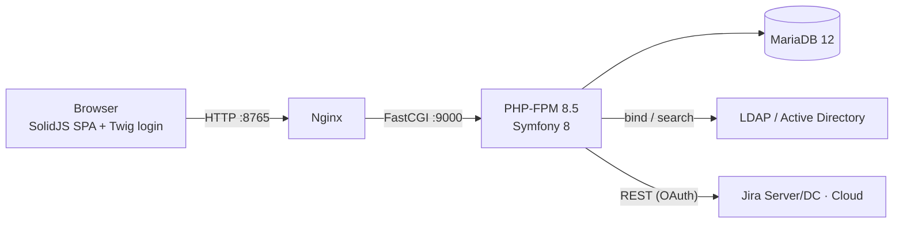

# Netresearch TimeTracker

[](https://www.php.net)
[](https://symfony.com)
[](LICENSE)
[](https://github.com/netresearch/timetracker/actions)
[](https://codecov.io/gh/netresearch/timetracker)
[](phpstan.neon)
[](https://github.com/netresearch/timetracker/releases)
[](https://securityscorecards.dev/viewer/?uri=github.com/netresearch/timetracker)
[](https://www.bestpractices.dev/projects/11719)
[](https://slsa.dev)

**Professional time tracking solution for teams and enterprises with advanced LDAP integration, Jira synchronization, and comprehensive reporting.**


---

## Table of Contents

- [About](#about)
- [Features](#features)
- [Screenshots](#screenshots)
- [Quick Start](#quick-start)
- [Requirements](#requirements)
- [Usage](#usage)
- [Configuration](#configuration)
- [Architecture](#architecture)
- [Documentation](#documentation)
- [Development](#development)
- [Testing](#testing)
- [Deployment](#deployment)
- [Contributing](#contributing)
- [Security](#security)
- [License](#license)
- [Support](#support)

---

## About

TimeTracker is a self-hosted web application for project- and customer-based
time tracking, built and used in production by
[Netresearch](https://www.netresearch.de). Employees log their work in a
fast, keyboard-friendly grid; project leads export monthly statements for
controlling and invoicing; worklogs are mirrored to Jira automatically.

- **Self-hosted & open source** — AGPL-3.0, ships as a Docker image
- **Enterprise sign-in** — LDAP / Active Directory with automatic user provisioning
- **Built for speed** — inline grid editing, terse time input (`930` → `09:30`),
  ticket-based autocompletion, shortcuts for everything
- **Accessible** — WCAG 2.2 AA target with a documented AAA subset
  (7:1 contrast in both color schemes, full keyboard operation)
- **Bilingual** — English and German UI, switchable per user

## Features

**Time tracking**
- Spreadsheet-like worklog grid with inline editing and autosave
- Smart autocompletion: typing a ticket number fills in project and customer
- Suggested start/end times, continue/prolong actions, overlap and gap highlighting
- Bulk entry for vacation and sick leave from admin-managed presets,
  honoring per-user contract hours, weekends and public holidays

**Reporting & export**
- Monthly overview calendar with contract targets and running balance
- Evaluation page: effort breakdowns by customer, project, ticket, activity,
  user and day, with flexible filters and date presets
- XLSX monthly statement for controlling (billable-only filter, ticket titles)
  and per-user CSV export

**Administration**
- Manage customers, projects, users, teams, holidays, presets, ticket systems,
  activities and work contracts in one shared CRUD shell with inline editing,
  filtering, CSV export and bulk actions
- Role model: `USER`/`DEV` track time; `PL` and `ADMIN` additionally get
  Billing and Administration

**Jira integration**
- Automatic background worklog sync (create/update/delete) via OAuth 1.0a for
  Jira Server/DC; Jira Cloud OAuth 2.0 support is in progress
- Per-user, per-ticket-system tokens, encrypted at rest
- Optional mirroring of external customer tickets into an internal Jira project

**Quality of life**
- Light/dark/system theme, three UI densities, top-bar or sidebar navigation
- Command palette (<kbd>Ctrl</kbd>/<kbd>⌘</kbd>+<kbd>K</kbd>) and a full
  keyboard-shortcut system with discoverable <kbd>Alt</kbd> badges
- In-app help with per-page explanations, legend and shortcut tables

## Screenshots

| | |
|---|---|
|  *Dark theme* |  *Monthly overview with contract balance* |
|  *Evaluation filters and breakdowns* |  *Command palette (Ctrl/⌘+K)* |

Many more in the **[User Guide](docs/user-guide.md)**.

## Quick Start

### Using Docker (Recommended)

```bash
git clone https://github.com/netresearch/timetracker.git
cd timetracker

make up          # build and start the dev stack (app, nginx, MariaDB, dev LDAP)
make install     # composer + frontend dependencies
make db-migrate  # apply database migrations

# Access the application
open http://localhost:8765
```

Sign in with one of the seeded development LDAP users, e.g. `i.myself` /
`myself123` (project lead — sees all features) or `developer` / `dev123`
(regular user). See [docs/development.md](docs/development.md) for the full list.

### Manual Installation

```bash
# Prerequisites: PHP 8.5+, MariaDB/MySQL, Composer, bun (frontend), Node.js 26+ (e2e)
composer install
cd frontend && bun install && bun run build && cd ..

# The committed .env ships development defaults. Create a .env.local to
# override what differs on your machine — at least DATABASE_URL and the
# LDAP_* settings. (.env.example only holds Docker Compose variables.)

php bin/console doctrine:database:create
php bin/console doctrine:migrations:migrate

symfony server:start
```

## Requirements

- **PHP**: 8.5 with extensions: `ldap`, `pdo_mysql`, `intl`, `mbstring`
- **Database**: MariaDB 12+ or MySQL 8.0+
- **LDAP / Active Directory**: any LDAP v3 server for authentication
  (a preconfigured dev LDAP container ships with the Docker setup)
- **Node.js**: 26+ (for the Playwright e2e tooling; the frontend builds with bun)

## Usage

- **[User Guide](docs/user-guide.md)** — every feature explained, with screenshots
- **[FAQ](docs/FAQ.md)** — quick answers to common questions
- **In-app help** — press <kbd>?</kbd> in the app, or open the **?** icon in the header

## Configuration

Runtime configuration happens through environment variables (`.env` /
`.env.local`); Jira ticket systems are configured in the admin UI, not env vars.
The most important variables:

| Variable | Purpose |
|----------|---------|
| `DATABASE_URL` | MariaDB/MySQL connection string |
| `LDAP_HOST`, `LDAP_BASEDN`, … | LDAP/AD connection (8 variables) |
| `LDAP_CREATE_USER` | Auto-create accounts on first successful login |
| `APP_TITLE`, `APP_LOGO_URL` | Branding |
| `APP_LOCALE` | Default language (`en`/`de`) |
| `APP_ENCRYPTION_KEY` | Encrypts stored Jira tokens at rest |

Full reference: [docs/configuration.md](docs/configuration.md)

## Architecture



- **Backend**: PHP 8.5, Symfony 8, Doctrine ORM 3 — controllers are
  single-action classes; business logic lives in services
- **Frontend**: SolidJS 1.9 + TypeScript SPA under `/ui/`, built with
  Vite 8 and bun, styled with Tailwind CSS 4 and design tokens
- **Testing**: PHPUnit 13 (unit/integration/controller/api), Playwright e2e,
  Vitest for the frontend, PHPStan level 10, PHP-CS-Fixer, Rector
- **Infrastructure**: Docker (multi-stage bake), GitHub Actions CI/CD,
  SLSA 3 provenance

Details: [docs/techstack.md](docs/techstack.md) ·
Decisions: [docs/adr/](docs/adr/README.md)

## Documentation

| Guide | Description |
|-------|-------------|
| [User Guide](docs/user-guide.md) | Using the app, with screenshots |
| [FAQ](docs/FAQ.md) | Common questions, quick answers |
| [Features](docs/features.md) | Feature overview at a glance |
| [Development](docs/development.md) | Local setup and development workflow |
| [Configuration](docs/configuration.md) | Environment variables and settings |
| [API Reference](docs/api.md) | REST API endpoints and examples |
| [Testing](docs/testing.md) | Testing strategy and commands |
| [Security](docs/security.md) | Security implementation details |
| [Deployment](docs/DEPLOYMENT_GUIDE.md) | Production deployment guide |
| [Troubleshooting](docs/TROUBLESHOOTING.md) | Common issues and solutions |
| [Architecture Decisions](docs/adr/README.md) | ADRs — why things are the way they are |

## Development

```bash
# Run tests
make test

# Static analysis & code style
make check-all

# Fix code style
make fix-all

# Frontend dev server with HMR
cd frontend && bun run dev
```

### Code Quality Standards

- PER-CS + Symfony code style (PHP-CS-Fixer, `@PER-CS` + `@Symfony` rulesets — see [.php-cs-fixer.dist.php](.php-cs-fixer.dist.php))
- PHPStan Level 10 static analysis
- PHPUnit tests
- Conventional Commits
- Git hooks via CaptainHook run the full quality gate before every commit

See [CONTRIBUTING.md](CONTRIBUTING.md) for contribution guidelines and
[CODE_OF_CONDUCT.md](CODE_OF_CONDUCT.md) for community standards.

## Testing

```bash
make test          # PHPUnit against the seeded test database
make e2e           # Playwright end-to-end suite (starts its own stack)
cd frontend && bun run test   # frontend unit tests (Vitest)
```

CI runs the full matrix on every PR: lint/static analysis, unit, integration,
frontend, and ten sharded e2e jobs. See [docs/testing.md](docs/testing.md).

## Deployment

Production runs from the published container image
`ghcr.io/netresearch/timetracker` (tags: `production`, `latest`, semver) behind
nginx, with MariaDB and TLS terminated at your reverse proxy:

```bash
COMPOSE_PROFILES=prod docker compose up -d
```

Step-by-step instructions, env-var reference, backup/upgrade/rollback
procedures and a production checklist: [docs/DEPLOYMENT_GUIDE.md](docs/DEPLOYMENT_GUIDE.md)

## Contributing

Contributions are welcome! Please read [CONTRIBUTING.md](CONTRIBUTING.md)
first — it covers the workflow (fork → branch → PR), Conventional Commits,
the DCO sign-off requirement, and the quality gates your change must pass.

Good first steps: check the
[open issues](https://github.com/netresearch/timetracker/issues) or improve
the documentation.

## Security

Please report vulnerabilities privately as described in
[SECURITY.md](SECURITY.md) — do not open public issues for security problems.
Only the 5.x line receives security updates.

## License

This project is licensed under the **AGPL-3.0 License** - see [LICENSE](LICENSE) for details.

## Support

- **Documentation**: [docs/](docs/)
- **Issues**: [GitHub Issues](https://github.com/netresearch/timetracker/issues)
- **Discussions**: [GitHub Discussions](https://github.com/netresearch/timetracker/discussions)

---

<p align="center">
  <b>Built by <a href="https://www.netresearch.de">Netresearch</a></b>
</p>
