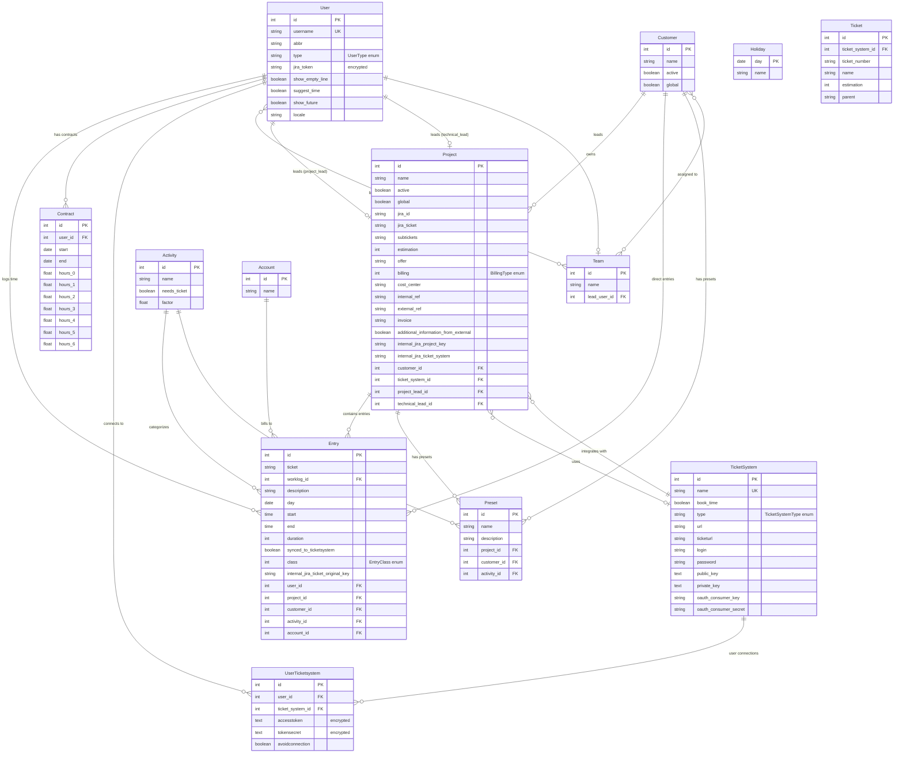

# TimeTracker Entity Relationship Diagram

## Visual Entity Relationships



## Relationship Types and Cardinality

### One-to-Many Relationships

| Parent Entity | Child Entity | Relationship | Foreign Key | Cascade |
|---------------|--------------|-------------|-------------|---------|
| User | Entry | User logs multiple time entries | user_id | None |
| User | Contract | User has multiple contracts over time | user_id | None |
| User | UserTicketsystem | User connects to multiple ticket systems | user_id | None |
| Customer | Project | Customer owns multiple projects | customer_id | None |
| Customer | Entry | Customer has direct time entries | customer_id | None |
| Customer | Preset | Customer has multiple presets | customer_id | None |
| Project | Entry | Project contains multiple entries | project_id | None |
| Project | Preset | Project has multiple presets | project_id | None |
| Activity | Entry | Activity categorizes multiple entries | activity_id | None |
| Activity | Preset | Activity defines multiple presets | activity_id | None |
| Account | Entry | Account bills multiple entries | account_id | None |
| TicketSystem | UserTicketsystem | System has multiple user connections | ticket_system_id | None |
| TicketSystem | Project | System integrates with multiple projects | ticket_system_id | None |

### Many-to-Many Relationships

| Entity 1 | Entity 2 | Join Table | Entity 1 FK | Entity 2 FK | Cascade |
|----------|----------|------------|-------------|-------------|---------|
| User | Team | teams_users | user_id | team_id | CASCADE DELETE both |
| Team | Customer | teams_customers | team_id | customer_id | None |

### Self-Referencing Relationships

| Entity | Type | Reference | Description |
|--------|------|-----------|-------------|
| User | One-to-One | project_lead_id | Project → User (project lead) |
| User | One-to-One | technical_lead_id | Project → User (technical lead) |
| User | One-to-One | lead_user_id | Team → User (team lead) |

## Key Constraints and Indexes

### Primary Keys
- All entities use auto-incrementing integer primary keys except:
  - `Holiday`: Uses `day` (date) as natural primary key

### Unique Constraints
- `User.username`: Unique across all users
- `TicketSystem.name`: Unique system names

### Foreign Key Constraints
- All foreign keys maintain referential integrity
- Most allow NULL values for optional relationships
- Critical relationships (User→Entry) are required

### Performance Indexes

#### Entry Table (Primary Query Target)
```sql
-- Most common query patterns
CREATE INDEX idx_entries_user_day ON entries (user_id, day DESC);
CREATE INDEX idx_entries_day ON entries (day);
CREATE INDEX idx_entries_user_project ON entries (user_id, project_id);
CREATE INDEX idx_entries_user_sync ON entries (user_id, synced_to_ticketsystem);
CREATE INDEX idx_entries_day_start ON entries (day DESC, start DESC);

-- Entity relationship indexes
CREATE INDEX idx_entries_customer ON entries (customer_id);
CREATE INDEX idx_entries_project ON entries (project_id);
CREATE INDEX idx_entries_activity ON entries (activity_id);
CREATE INDEX idx_entries_ticket ON entries (ticket);
CREATE INDEX idx_entries_worklog ON entries (worklog_id);
```

#### User Ticket System Performance
```sql
CREATE INDEX idx_user_ticket_system_user ON users_ticket_systems (user_id);
```

## Data Flow Patterns

### Time Entry Creation Flow
```
User → Select Project → Select Activity → Create Entry
  ↓         ↓             ↓              ↓
Team → Customer → Ticket System → External Sync
```

### Reporting Query Patterns
```
1. User Time Reports: User → Entry → Project → Customer
2. Project Reports: Customer → Project → Entry → User
3. Team Reports: Team → User → Entry → Project
4. Activity Reports: Activity → Entry → User → Project
```

### Integration Sync Patterns
```
User → UserTicketsystem → TicketSystem → External API
  ↓                                          ↓
Entry ←← Worklog Sync ←←←←←←←←←←←←←←←← External Ticket
```

## Business Logic Relationships

### Access Control Hierarchy
```
Admin → Full Access
  ↓
Project Lead → Team Projects + Customer Access
  ↓
Developer/User → Team Customer Projects Only
```

### Data Ownership Rules
```
User owns: Entries, Contracts, Ticket System Connections
Team controls: Customer Access, Project Visibility  
Project defines: Billing, External Integration
Customer contains: Projects, Direct Entries
```

### Validation Dependencies
```
Entry validation requires:
- Valid User (authentication)
- Valid Project OR Customer
- Valid Activity
- Valid time range (start < end, duration > 0)

Project validation requires:
- Valid Customer
- Valid Ticket System (if integration enabled)
- Valid Project/Technical Lead Users
```

This Entity Relationship Diagram provides a comprehensive view of the TimeTracker database structure, showing all relationships, constraints, and data flow patterns essential for understanding the system architecture.