.. header::
   .. image:: netresearch.jpg
      :height: 0.8cm
      :align: right

.. footer::
   .. class:: footertable

   +----------------------------+-----------------------------+----------------------------+
   | Stand: |date|              | .. class:: centeralign      | .. class:: rightalign      |
   |                            |                             |                            |
   |                            | Netresearch App Factory AG  | ###Page###/###Total###     |
   +----------------------------+-----------------------------+----------------------------+

.. |date| date:: %d/%m/%Y
.. |year| date:: %Y

=======================
Netresearch TimeTracker
=======================

|

.. sectnum::

.. contents:: Table of Contents

.. raw:: pdf

   PageBreak

Description
===========

Netresearch Timetracker is a Time Booking System.

It tracks working hours for employees and expenses for costumers/projects.
Beside working hours you can also track sick days and holidays.

Basics of work time calculations
--------------------------------

Work log is tracked in minutes and saved as integer.
Times are rendered in 24h hh:mm (13:30) format.
If useful their is an additional value for person days in parentheses (16:00 (2 PD))
One person day consist always of 8 hours.

|

Time tracking
=============

|

Add work log entry
------------------

Click the button **Add Entry**.
Or use the keyboard shortcut **a**.

Depending on your setting for `Suggest time`_ date and start/end time is set automatically.

An dieser Stelle ist es wichtig, die Zeiten und gegebenfalls das Datum anzupassen,
wenn zum Beispiel ein Eintrag nachgeholt werden soll, der in der Vergangenheit lag.

Das Vorausfüllen der Zeiten geschieht nach folgendem Prinzip: Sollte noch kein
Zeiterfassungseintrag für diesen Tag exisitieren, so wird  der Zeitpunkt des Öffnens
der Timetracker-Seite im Browser für die Startzeit genommen. Für die Endzeit wird
die Zeit des Moments, in dem der Eintrag angelegt wird, benutzt.
Sollten schon Einträge für den aktuellen Tag existieren, so wird die Endzeit des
letzten Eintrags automatisch als Startzeit für den neuen Eintrag übernommen.
Das Prinzip unterstützt damit optimal eine Erfassung am Ende jeder einzelnen
Tätigkeit. In diesem Falle muss keine Zeit manuell eingegeben werden.
Hinweis: Sollte eine Pause dazwischen gelegen haben, so ist die Startzeit anzupassen!

Beim Eintragen eines neuen Falles wird im Erfassungs-Grid die aktuelle Zeile als
aktiv markiert und der Cursor auf das Feld ""Datum"" in der Zeile gesetzt.
Wenn Die Zeit automatisch vorgeschlagen wird, geht der Cursor direkt in das Feld
 **Ticket**.

Im Feld **Fall** trägt man die JIRA- oder OTRS-Ticketnummer ein, zum Beispiel
**ABC-123**. Das Ticketformat lehnt sich an JIRA an.
Ist das Präfix des Tickets, hier **ABC**, eindeutig einem Kunden und/oder Projekt
zugewiesen, so ergänzt der Timetracker diese Eingaben selbstständig und setzt den
Cursor als nächstes in das Feld **Tätigkeit**.

Ist der Präfix nicht eindeutig, so wird der Cursor in das Feld **Kunde** gesetzt,
wo ein Dropdown aller derzeit aktiven Kunden aktiviert wird. Im nächsten Feld
**Projekt**  erscheint daraufhin eine Liste von aktiven Projekten dieses Kunden.

Im Feld **Tätigkeit** wird eine Liste möglicher Tätigkeiten wie "Konzeption",
"Entwicklung" im Dropdown angeboten, im darauf folgenden Feld **Beschreibung**
kann man diese in Freitext näher erläutern.

Einträge speichern
------------------

Das Speichern der Einträge findet automatisch und asynchron statt. Der Timetracker
kennzeichnet nicht gespeicherte Inhalte mit einem roten Zellenhintergrund. Behalten
Sie diese im Auge. Durch Latenzen bei der Netzwerkübertragung kann das Speichern
einige Sekunden benötigen. Wenn Ihnen das Speichern zu langsam erscheint, kontrollieren
Sie die Einträge noch einmal auf Validität.

Pflichtfelder zum Speichern eines Eintrags sind Datum, Start, Ende, Kunde und Projekt,
so dass zumindest erkennbar ist, wieviel Zeit für ein konkretes Projekt aufgewendet
wurde. Das Projekt muss natürlich zum Kunden passen, und das Ende muss mindestens
1 Minute nach dem Start liegen.

Einträge fortsetzen
-------------------

Sollten Sie bereits Einträge haben, und müssen sie an einer ähnlichen Sache, zum
Beispiel dem gleichen Ticket, weiterarbeiten, haben Sie die Möglichkeit, das Feature
**Fortsetzen** zu benutzen.
Führen Sie hierzu einen Rechtklick auf den zu kopierenden Eintrag aus und wählen
in dem sich öffnenden Kontextmenü den Eintrag **Fortsetzen**.
Beim Fortsetzen werden bis auf die Start und Endzeit alle Eintragungen des Eintrages
übernommen, den Sie fortsetzen möchten.

|

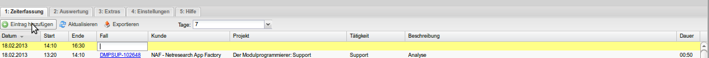

   Zeiterfassung - Einträge hinzufügen

Einträge bearbeiten
-------------------

Zum Bearbeiten eines Eintrages klicken Sie einfach in die zu ändernde Zelle und
korrigieren den dort vorhandenen Eintrag.
Dabei erfolgt die Bearbeitung in gleicher Weise wie bei Neuanlage.

Einträge löschen
----------------

Einträge können durch Rechtsklick auf die Zeile und den Button **Löschen** gelöscht werden.
Es erscheint ein Bestätigungsdialog, der noch einmal die Daten des Eintrags einblendet,
um sicherzugehen, dass Sie den richtigen Eintrag ausgewählt haben.

Info abrufen
------------

Mit einem Rechtsklick auf einen Eintrag kann man eine Info zum Eintrag abrufen,
die die auf diesen Kunden, das Projekt, das Ticket und die Tätigkeit im Projekt
gebuchte Gesamtsummen anzeigt, um einen schnellen Überblick zu erhalten.
Ist eine geschätzte Dauer am Projekt eingetragen wurden, so wird diese mit ausgegeben
und die Schätzung gegen die gebuchte Projektzeit verglichen und der aktuelle Stand
in Prozent angezeigt.

|

Auswertung
==========

Im Tab **Auswertung** haben Sie die Möglichkeit, die gebuchten Zeiten aller im
Timetracker angemeldeten Benutzer zu überblicken und auszuwerten.
Im Kopfbereich haben Sie die Möglichkeit, die Auswertung auf gewisse Suchen
einzuschränken (nach Monat, Jahr, Kunde, Projekt, Team, Mitarbeiter, Tätigkeit,
Ticket, Suche in Beschreibung), wenn Sie einen Filter ausgewählt haben, müssen
Sie danach den Button **Aktualisieren** klicken, um die Ansicht zu aktualisieren.
Es gibt verschiedene Übersichten der gebuchten Zeiten, nach **Kunde**, **Projekt**,
**Tickets**, **Tagen**, **Mitarbeiter** und **Tätigkeiten**. Außerdem werden die
letzten Einträge in einem der Erfassung gleichen Grid angezeigt, die um die Spalte
"Mitarbeiter" ergänzt ist.

|

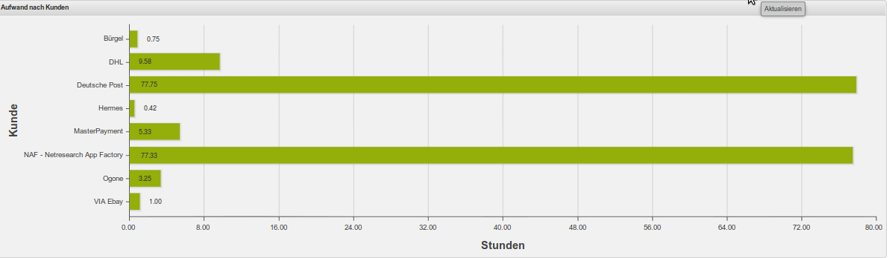

   Aufwand - Kunden

|

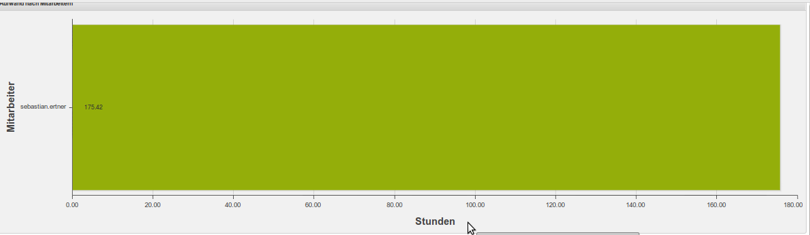

   Aufwand - Mitarbeiter

|

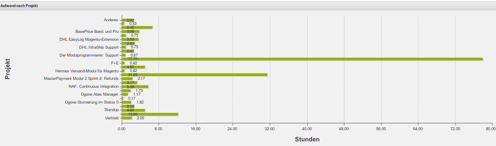

   Aufwand - Projekt

|

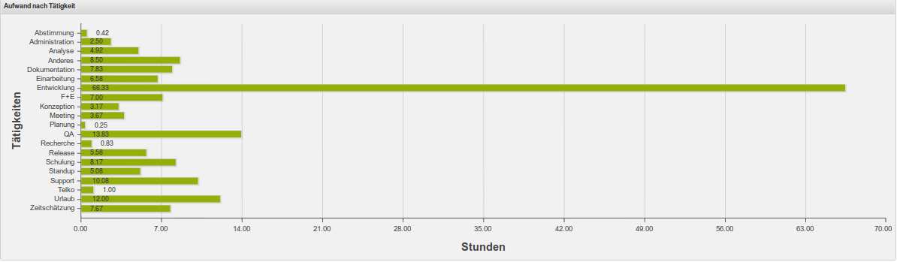

   Aufwand - Taetigkeit

|

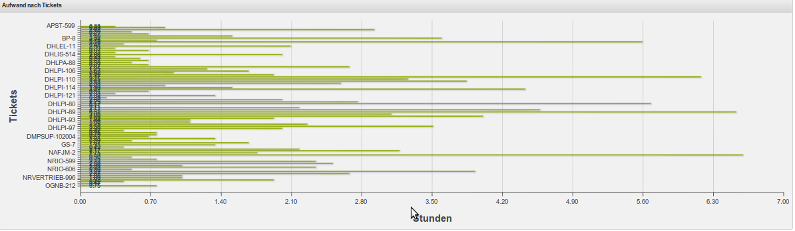

   Aufwand - Tickets

|

Extras
======

Im Tab **Extras** haben sie die Möglichkeit, Massen-Eintragungen vorzunehmen.
Dies ist nützlich, wenn Sie für mehrere Tage die gleichen Eintragungen brauchen,
beispielsweise bei Urlaub. Wählen Sie bei **Vorlage** Ihr gewünschtes Template
(Urlaub, Krank, etc.), unter **Start-Datum** den Begin und für End-Datum das Ende
Ihrer gewünschten Masseneintragung.
Bei den Feldern **von** und **bis** Tragen sie die Zeiten so ein, das sie einen
vollen Arbeitstag für Sie ergeben, zum 08:00-16:00 für einen 8h-Tag.
Bei den Feldern **Wochenende auslassen** und **Feiertage auslassen** können Sie
angeben, ob die Eintragungen Wochenenden oder Feiertage überspringen sollen.
Klicken sie am Ende auf **Eintragen**, um die Massen-Eintragung vorzunehmen.

|

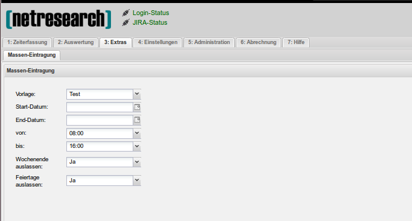

   Extras - Masseneintragungen

|

Einstellungen
=============

 .. list-table:: Grid-Verhalten
   :header-rows: 1
   :widths: 15 20 
  
   * - **Option**
     - **Verhalten**

   * - Immer leere Zeile anzeigen
     - bei der Zeiterfassung wird am Anfang immer eine leere Zeile angezeigt
   * - Suggest time
     -
   * - Zukunft anzeigen
     - bei der Zeiterfassung werden Zeiten angezeigt, deren Buchungsdatum in der Zukunft liegt

|

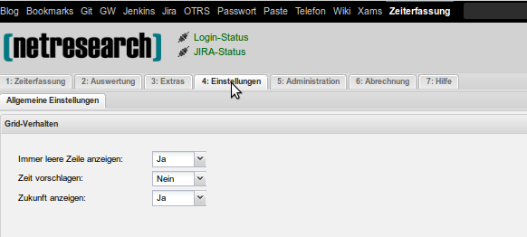

   Einstellungen - Grid

Suggest time
------------

Nei der Zeiterfassung wird entweder die aktuelle Uhrzeit des Eintrags, oder die
Endzeit des letzten Eintrages als Startzeit vorgeschlagen.

|

Administration
==============

|

Verwaltung von Kunden
---------------------

Im Tab **Administration**, Reiter **Verwaltung von Kunden** haben Sie die Möglichkeit,
neue Kunden im Timetracker anzulegen oder die Einstellung für bestehende Kunden zu ändern.
Um einen neuen Kunden anzulegen, klicken Sie im Kopfbereich auf **Neuer Kunde**,
ein Popup öffnet sich wo Sie den Kundennamen den Status  und die Sichtbarkeit angeben können.
Um einen bestehenden Kunden zu bearbeiten, klicken sie mit der rechten Maustaste
auf die entsprechende Zeile und wählen im Kontextmenü **bearbeiten** aus.

.. list-table:: Kunde bearbeiten
   :header-rows: 1
   :widths: 15 20 
  
   * - **Option**
     - **Beschreibung**

   * - Name
     - Der Kundenname im Timetracker
   * - aktiv
     - der status des Kunden aktiv/disable
   * - global ( für alle Teams)
     - Sichtbarkeit des Kunden für alle Teams
   * - Teams
     - Die Teams welche den Kunden im Timetracker in der Auswahl sehen können.

|

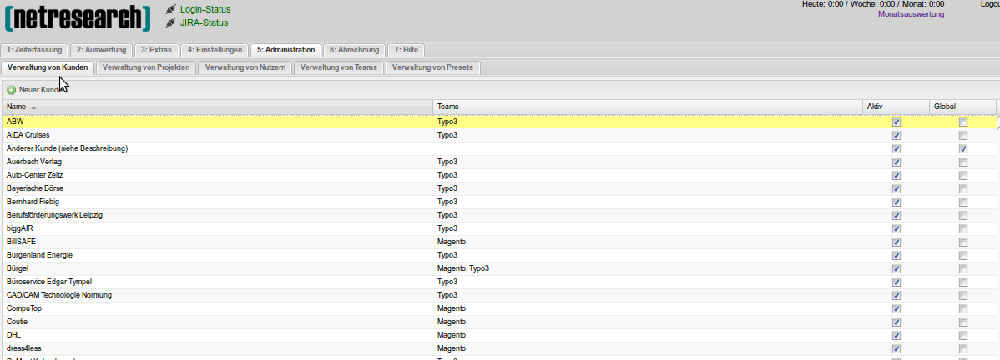

   Verwaltung - Kunden
	 

Verwaltung von Projekten
------------------------

Im Reiter **Verwaltung von Projekten** können Sie neue Projekte anlegen und bestehende
Projekte editieren.
Zum Anlegen eines neuen Timetracker-Projektes klicken sie im Kopfbereich auf den
Button **Neues Projekt**, im sich öffnendem Fenster können Sie den Projektnamen
vergeben, den betreffenden Kunden auswählen, das zu benutzende Ticketsystem auswählen
und den Status festlegen (aktiv oder inaktiv).

Für ein Projekt kann man eine geschätzte Dauer angeben. Das Format entspricht dem
von JIRA gewohnten Buchstaben wie "2w 3d 1h 45m", alternativ kann man auch Bruchzahlen,
zum Beispiel "10,5d" oder "10.5d" angeben. Reine Zahlenwerte werden als Minuten
interpretiert.
"d" steht für Tag (day) und für "8h", "w" steht für Woche (week) und damit für "5d" oder "40h".

Um ein bestehendes Projekt zu bearbeiten klicken sie mit der rechten Maustaste auf
entsprechende Zeile und wählen im Kontextmenü **Bearbeiten** aus.

.. list-table:: Projekt bearbeiten
   :header-rows: 1
   :widths: 15 20 
  
   * - **Option**
     - **Beschreibung**

   * - Name
     - Projektname im Timetracker
   * - Kunde
     - der betreffende zum Projekt gehörende Kunde
   * - Ticket-System
     - Das zu benutzende Ticket-System
   * - Jira-Präfix
     - Der Projekt-Präfix im Jira (BP, NRVERTRIEB, usw.)
   * - aktiv
     - Projekt aktiv/disable
   * - global (für alle Kunden)
     - Projekt gilt für alle Kunden

|

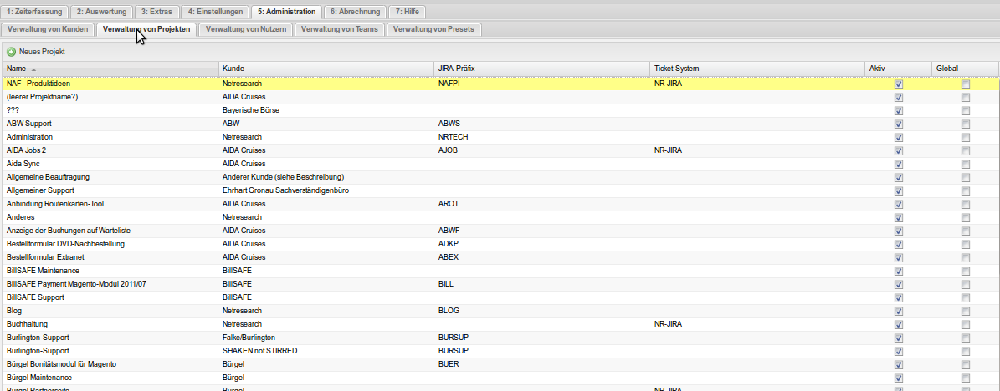

   Verwaltung - Projekte

Verwaltung von Nutzern
-----------------------

Im Reiter **Verwaltung von Nutzern** haben Sie die Möglichkeit, neue Benutzer
anzulegen oder bestehende Benutzer zu editieren.
Um einen neuen Nutzer anzulegen, klicken Sie im Kofpbereich auf den Button **Neuer Nutzer**
und nehmen im dem sich öffnenden Fenster alle nötigen Eintragungen vor, anschließend
klicken Sie auf speichern.
Um einen bestehendem Nutzer zu bearbeiten klicken sie mit der rechten Maustaste auf
entsprechende Zeile und wählen im Kontextmenü **Bearbeiten** aus.

|

.. list-table:: Nutzer bearbeiten
   :header-rows: 1
   :widths: 15 20 
  
   * - **Option**
     - **Beschreibung**

   * - Username
     - Der Benutzername im Timetracker
   * - Kürzel
     - das Kürzel des betreffenden Mitarbeiters
   * - Typ
     - Der Benutzer-Typ (Administrator, Entwickler, usw.)
   * - Teams
     - Die Teamzugehörigkeit des betreffenden Benutzers

|

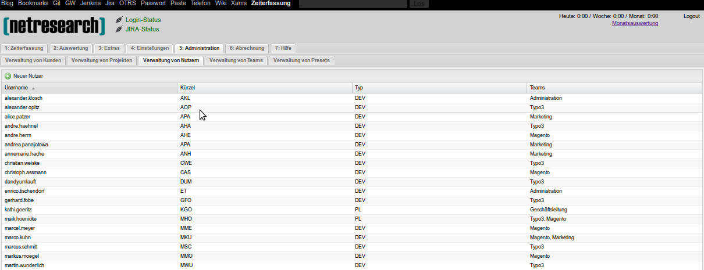

   Verwaltung - Nutzer

Verwaltung von Teams
--------------------

|

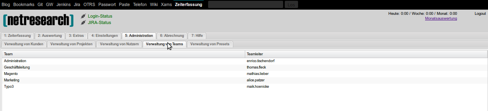

   Verwaltung - Teams

Verwaltung von Presets
-----------------------

Hier haben Sie die Möglichkeit eigene Presets zu erstellen oder bestehende zu bearbeiten.
Zum Erstellen eines neuen Presets klicken Sie auf den Button **Neues Preset**.
Nehmen Sie im folgenden Fenster die benötigten Eintragungen vor.
Um einen bestehendes Presets zu bearbeiten, klicken Sie mit der rechten Maustaste
auf entsprechende Zeile und wählen im Kontextmenü **Bearbeiten** aus.
Sollten Sie ein bestehendes Preset löschen wollen, wählen Sie im Kontextmenü den
Eintrag **Löschen**.

|

.. list-table:: Nutzer bearbeiten
   :header-rows: 1
   :widths: 15 20 
  
   * - **Option**
     - **Beschreibung**

   * - Name
     - Der Name des Presets
   * - Kunde
     - Der Kunde, welcher bei Benutzung des Presets eingetragen werden soll.
   * - Projekt
     - Die Projekt, welches bei Benutzung des Presets eingetragen werden soll.
   * - Tätigkeit
     - Die Tätigkeit, welche bei Benutzung des Presets eingetragen werden soll.
   * - Beschreibung
     - Die Beschreibung des Presets

|

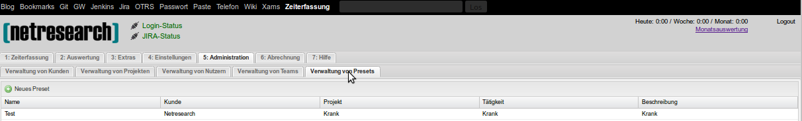

   Verwaltung - Presets
 
|

Abrechnung
==========

Im Tab **Abrechnung** haben Sie bei entsprechender Berechtigung die Möglichkeit,
Timetracker-Daten als CSV-Datei zu exportieren.
Sie können dabei nach Mitarbeiter, Jahr und Monat wählen.
Um die Daten eines bestimmten Mitarbeiters zu exportieren, wählen Sie den
entsprechenden Mitarbeiter, das benötigte Jahr und Monat und klicken anschließend
auf den Button **Exportieren**.
Um alle Mitarbeiter zu exportieren, wählen Sie nur das Jahr und den Monat und lassen
das Feld für den Mitarbeiter frei.

|

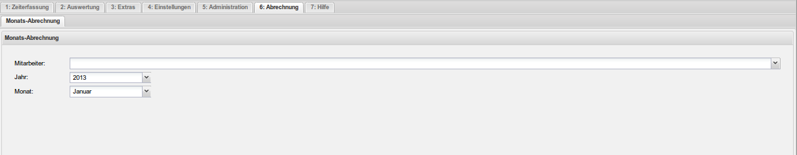

   Abrechnung

|

Hilfe
=====

Hier finden Sie Hilfestellung zu diversen Timetracker-Themen.

|

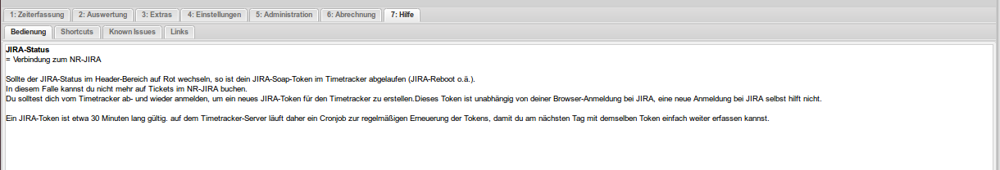

   Hilfe

   
Shortcuts
---------

Übersicht über die zur Verfügung stehenden Tastenkürzel.

.. list-table:: Global
   :header-rows: 1
   :widths: 15 20 

   * - **Shortcut**
     - **Aktion**
   * - ALT + 1 
     - 1.Tab anwählen
   * - ALT + 2 
     - 2.Tab anwählen
   * - ALT + 3 
     - 3.Tab anwählen
   * - ALT + 4 
     - 4.Tab anwählen
   * - ALT + 5 
     - 5.Tab anwählen
   * - ALT + 6 
     - 6.Tab anwählen
   * - ALT + 7  
     - 7.Tab anwählen

.. list-table:: Tab Erfassung
   :header-rows: 1
   :widths: 15 20 

   * - **Shortcut**
     - **Aktion**
   * - ALT + a 
     - Neuen Eintrag anlegen (Add)
   * - ALT + c 
     - Selektierten/Letzten Eintrag fortsetzen (Continue)
   * - ALT + d 
     - Selektierten/Letzten Eintrag löschen (Delete)
   * - ALT + e 
     - Selektierten/Letzten Eintrag editieren (Edit)
   * - ALT + i 
     - Info zu selektiertem/letztem Eintrag anzeigen (Info)
   * - ALT + p 
     - Letzten Eintrag verlängern auf aktuelle Zeit (Prolong)
   * - ALT + r 
     - Ansicht aktualisieren (Refresh)
   * - ?
     - Hilfe-Dialog aufrufen

.. list-table:: Tab Auswertung
   :header-rows: 1
   :widths: 15 20 

   * - **Shortcut**
     - **Aktion**
   * - ALT + r 
     - Ansicht aktualisieren (Refresh)
   * - ? 
     - Hilfe-Dialog aufrufen

.. raw:: pdf

   PageBreak

Known Issue
-----------

**Momentane Known Issues:**

Uhrzeiten-Bug: Wenn man eine Zeit editiert, werden die Zahlen komplett beim Eintippen
gelöscht.
Workaround: Uhrzeiten beim Editieren immer komplett löschen und neu eingeben.

Firefox/Adblocker und ?-Taste: Die Hilfetaste ? funktioniert nicht, wenn im Firefox
Ad-Blocker installiert sind.
Workaround: Chrome/Chromium/Opera benutzen oder Ad-Blocker
deinstallieren.

|

Sonstiges
=========

|

Fokus
-----

Der Fokus wird weiterhin initial auf die Startzeit gesetzt.
Wird aber ein Vorgänger-Eintrag am gleichen Tag gefunden, ist davon auszugehen,
dass diese nahtlos aneinanderliegen und der Fokus wird auf den Kunden gesetzt.
Sind Kunde und Projekt bekannt, weil zB ein Ticket-Prefix benutzt wurde, so wird
der Fokus auf die Tätigkeit gesetzt.

