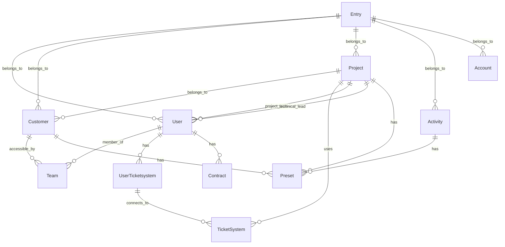

# TimeTracker Entity Layer Documentation

This document provides comprehensive documentation for all entities in the TimeTracker application, their relationships, database schema patterns, and Doctrine ORM integration.

## Table of Contents

1. [Entity Overview](#entity-overview)
2. [Core Business Entities](#core-business-entities)
3. [Entity Relationship Diagram](#entity-relationship-diagram)
4. [Detailed Entity Documentation](#detailed-entity-documentation)
5. [Database Schema Patterns](#database-schema-patterns)
6. [Doctrine ORM Integration](#doctrine-orm-integration)

## Entity Overview

The TimeTracker application manages 14 main entities organized around time tracking, user management, and ticket system integration:

| Entity | Purpose | Table Name | Business Domain |
|--------|---------|------------|-----------------|
| `Entry` | Time tracking entries (main entity) | `entries` | Time Tracking |
| `User` | System users with roles and permissions | `users` | User Management |
| `Customer` | Client organizations | `customers` | Business Organization |
| `Project` | Customer projects | `projects` | Project Management |
| `Activity` | Work activity types | `activities` | Time Categorization |
| `Team` | User groups for access control | `teams` | User Management |
| `Contract` | User working hours contracts | `contracts` | HR Management |
| `Preset` | Bulk entry templates | `presets` | User Productivity |
| `Account` | Accounting/billing accounts | `accounts` | Financial Management |
| `TicketSystem` | External ticket system configurations | `ticket_systems` | Integration |
| `UserTicketsystem` | User-specific ticket system tokens | `users_ticket_systems` | Integration |
| `Ticket` | Cached ticket information | `tickets` | Integration |
| `Holiday` | Public holidays calendar | `holidays` | Time Management |

## Core Business Entities

### Primary Entities

**Entry** - The central entity representing individual time tracking records
- Links to User, Customer, Project, Activity, and Account
- Contains start/end times, duration, descriptions, and ticket references
- Supports external ticket system integration

**User** - System users with authentication and preferences
- Implements Symfony UserInterface for security
- Contains user preferences, locale settings, and JIRA tokens
- Links to Teams, Contracts, and UserTicketsystems

**Customer** - Client organizations that own projects
- Can be marked as global (available to all users)
- Links to Projects, Entries, Teams, and Presets

**Project** - Work projects belonging to customers
- Contains estimation, billing information, and external references
- Links to TicketSystems for integration
- Has project leads and technical leads

**Activity** - Categorizes the type of work performed
- Special activities: "Krank" (sick), "Urlaub" (holiday)
- Contains factor multipliers and ticket requirements

## Entity Relationship Diagram

## Detailed Entity Documentation

### Entry Entity

**Table:** `entries`
**Repository:** `EntryRepository`

The main time tracking entity that records work performed by users.

#### Key Properties

| Property | Type | Required | Description |
|----------|------|----------|-------------|
| `id` | `int` | Yes | Primary key |
| `ticket` | `string(32)` | No | External ticket reference |
| `worklog_id` | `int` | No | External worklog ID |
| `description` | `string` | Yes | Work description |
| `day` | `date` | Yes | Work date |
| `start` | `time` | Yes | Start time |
| `end` | `time` | Yes | End time |
| `duration` | `int` | Yes | Duration in minutes (calculated) |
| `class` | `EntryClass` | Yes | Entry classification enum |
| `synced_to_ticketsystem` | `bool` | No | External sync status |

#### Relationships

- **ManyToOne** → `User` (user_id): The user who created the entry
- **ManyToOne** → `Customer` (customer_id): Target customer
- **ManyToOne** → `Project` (project_id): Target project
- **ManyToOne** → `Activity` (activity_id): Work activity type
- **ManyToOne** → `Account` (account_id): Billing account

#### Business Rules

- End time must be greater than start time
- Duration is automatically calculated from start/end times
- External ticket integration through worklog_id
- Supports billable flag for external label processing

#### Non-Persisted Properties

- `billable`: Runtime flag based on external labels
- `externalSummary`: Summary from ticket system
- `externalLabels`: Array of external ticket labels
- `externalReporter`: External ticket reporter
- `ticketTitle`: Title from ticket system

### User Entity

**Table:** `users`
**Repository:** `UserRepository`
**Implements:** `UserInterface`

System users with authentication and user preferences.

#### Key Properties

| Property | Type | Required | Description |
|----------|------|----------|-------------|
| `id` | `int` | Yes | Primary key |
| `username` | `string(50)` | Yes | Login username |
| `abbr` | `string(3)` | No | User abbreviation |
| `type` | `UserType` | Yes | User role enum |
| `jiraToken` | `string(255)` | No | JIRA authentication token |
| `showEmptyLine` | `bool` | No | UI preference |
| `suggestTime` | `bool` | Yes | Time suggestion preference |
| `showFuture` | `bool` | Yes | Future date display preference |
| `locale` | `string(2)` | Yes | User locale (default: 'de') |

#### Relationships

- **ManyToMany** → `Team` (teams_users join table): Team memberships
- **OneToMany** ← `Entry`: User's time entries
- **OneToMany** ← `Contract`: User's work contracts
- **OneToMany** ← `UserTicketsystem`: Ticket system connections

#### Security Integration

- Implements Symfony `UserInterface`
- Role-based access through `UserType` enum
- Password-less authentication (LDAP integration)
- Remember-me functionality through generated hash

### Customer Entity

**Table:** `customers`
**Repository:** `CustomerRepository`

Client organizations that own projects and can be assigned to teams.

#### Key Properties

| Property | Type | Required | Description |
|----------|------|----------|-------------|
| `id` | `int` | Yes | Primary key |
| `name` | `string(255)` | Yes | Customer name |
| `active` | `bool` | No | Active status |
| `global` | `bool` | No | Available to all users |

#### Relationships

- **OneToMany** ← `Project`: Customer's projects
- **OneToMany** ← `Entry`: Direct customer entries
- **OneToMany** ← `Preset`: Customer-specific presets
- **ManyToMany** → `Team` (teams_customers join table): Team access control

### Project Entity

**Table:** `projects`
**Repository:** `ProjectRepository`

Work projects that belong to customers and integrate with external systems.

#### Key Properties

| Property | Type | Required | Description |
|----------|------|----------|-------------|
| `id` | `int` | Yes | Primary key |
| `name` | `string(127)` | Yes | Project name |
| `active` | `bool` | No | Active status |
| `global` | `bool` | No | Available to all users |
| `jiraId` | `string(63)` | No | External JIRA project ID |
| `jiraTicket` | `string(255)` | No | Main JIRA ticket |
| `subtickets` | `string(255)` | No | Comma-separated subtickets |
| `estimation` | `int` | No | Estimated duration (minutes) |
| `offer` | `string(31)` | No | Offer number |
| `billing` | `BillingType` | No | Billing method enum |
| `costCenter` | `string(31)` | No | Cost center |
| `internalReference` | `string(31)` | No | Internal reference |
| `externalReference` | `string(31)` | No | External reference |
| `invoice` | `string(31)` | No | Invoice number |

#### Relationships

- **ManyToOne** → `Customer`: Project owner
- **ManyToOne** → `TicketSystem`: External ticket integration
- **ManyToOne** → `User` (projectLead): Project manager
- **ManyToOne** → `User` (technicalLead): Technical lead
- **OneToMany** ← `Entry`: Project time entries
- **OneToMany** ← `Preset`: Project-specific presets

#### External Integration

- Support for JIRA project keys (comma-separated)
- Internal JIRA project mapping
- Ticket system URL generation

### Activity Entity

**Table:** `activities`
**Repository:** `ActivityRepository`

Categorizes the type of work performed in time entries.

#### Key Properties

| Property | Type | Required | Description |
|----------|------|----------|-------------|
| `id` | `int` | Yes | Primary key |
| `name` | `string(50)` | Yes | Activity name |
| `needsTicket` | `bool` | No | Requires ticket reference |
| `factor` | `float` | No | Time calculation multiplier |

#### Special Activities

- `SICK` = "Krank": Sick leave tracking
- `HOLIDAY` = "Urlaub": Vacation tracking

#### Relationships

- **OneToMany** ← `Entry`: Entries using this activity
- **OneToMany** ← `Preset`: Presets using this activity

### Team Entity

**Table:** `teams`
**Repository:** `TeamRepository`

User groups for access control and customer assignment.

#### Key Properties

| Property | Type | Required | Description |
|----------|------|----------|-------------|
| `id` | `int` | Yes | Primary key |
| `name` | `string(31)` | Yes | Team name |

#### Relationships

- **ManyToOne** → `User` (leadUser): Team leader
- **ManyToMany** ← `User`: Team members
- **ManyToMany** ← `Customer`: Accessible customers

### Contract Entity

**Table:** `contracts`
**Repository:** `ContractRepository`

User working hours contracts with daily hour specifications.

#### Key Properties

| Property | Type | Required | Description |
|----------|------|----------|-------------|
| `id` | `int` | Yes | Primary key |
| `start` | `date` | Yes | Contract start date |
| `end` | `date` | No | Contract end date |
| `hours_0` to `hours_6` | `float` | Yes | Hours for each weekday |

#### Relationships

- **ManyToOne** → `User`: Contract owner

#### Business Logic

- Defines expected working hours per weekday (0=Sunday, 6=Saturday)
- Supports flexible working hour arrangements
- Used for time tracking validation and reporting

### Preset Entity

**Table:** `presets`
**Repository:** `PresetRepository`

Templates for bulk entry creation with predefined values.

#### Key Properties

| Property | Type | Required | Description |
|----------|------|----------|-------------|
| `id` | `int` | Yes | Primary key |
| `name` | `string` | Yes | Preset name |
| `description` | `string` | Yes | Default description |

#### Relationships

- **ManyToOne** → `Project`: Target project
- **ManyToOne** → `Customer`: Target customer
- **ManyToOne** → `Activity`: Target activity

### Account Entity

**Table:** `accounts`

Simple accounting/billing accounts for entry categorization.

#### Key Properties

| Property | Type | Required | Description |
|----------|------|----------|-------------|
| `id` | `int` | Yes | Primary key |
| `name` | `string(50)` | Yes | Account name |

#### Relationships

- **OneToMany** ← `Entry`: Entries assigned to account

### TicketSystem Entity

**Table:** `ticket_systems`
**Repository:** `TicketSystemRepository`

Configuration for external ticket system integration.

#### Key Properties

| Property | Type | Required | Description |
|----------|------|----------|-------------|
| `id` | `int` | Yes | Primary key |
| `name` | `string(31)` | Yes | System name (unique) |
| `bookTime` | `bool` | No | Supports time booking |
| `type` | `TicketSystemType` | Yes | System type enum |
| `url` | `string(255)` | Yes | Base URL |
| `ticketUrl` | `string(255)` | Yes | Ticket URL template |
| `login` | `string(63)` | Yes | Login username |
| `password` | `string(63)` | Yes | Login password |
| `publicKey` | `text` | No | OAuth public key |
| `privateKey` | `text` | No | OAuth private key |
| `oauthConsumerKey` | `string(255)` | No | OAuth consumer key |
| `oauthConsumerSecret` | `string(255)` | No | OAuth consumer secret |

#### Supported Systems

- JIRA integration with OAuth support
- Configurable ticket URL templates
- Time booking capabilities

### UserTicketsystem Entity

**Table:** `users_ticket_systems`

Junction entity storing user-specific ticket system authentication.

#### Key Properties

| Property | Type | Required | Description |
|----------|------|----------|-------------|
| `id` | `int` | Yes | Primary key |
| `accessToken` | `text` | Yes | Encrypted OAuth access token |
| `tokenSecret` | `text` | Yes | Encrypted OAuth token secret |
| `avoidConnection` | `bool` | No | Disable connection flag |

#### Relationships

- **ManyToOne** → `TicketSystem`: Target system
- **ManyToOne** → `User`: Token owner

### Ticket Entity

**Table:** `tickets`

Cached ticket information from external systems.

#### Key Properties

| Property | Type | Required | Description |
|----------|------|----------|-------------|
| `id` | `int` | Yes | Primary key |
| `ticketSystemId` | `int` | Yes | Source ticket system |
| `ticketNumber` | `string(31)` | Yes | Ticket identifier |
| `name` | `string(127)` | Yes | Ticket title |
| `estimatedDuration` | `int` | No | Duration estimate (minutes) |
| `parentTicketNumber` | `string(31)` | No | Parent ticket reference |

### Holiday Entity

**Table:** `holidays`
**Repository:** `HolidayRepository`

Public holidays calendar for time tracking validation.

#### Key Properties

| Property | Type | Required | Description |
|----------|------|----------|-------------|
| `day` | `date` | Yes | Holiday date (composite primary key) |
| `name` | `string(255)` | Yes | Holiday name |

#### Special Features

- Readonly properties after construction
- Immutable design pattern
- Used for work day validation

## Database Schema Patterns

### Naming Conventions

- **Table Names**: Plural, lowercase with underscores (`users`, `ticket_systems`)
- **Column Names**: Snake_case (`user_id`, `ticket_system_id`)
- **Join Tables**: `{table1}_{table2}` format (`teams_users`, `teams_customers`)

### Primary Keys

- All entities use auto-incrementing integer primary keys
- Exception: `Holiday` uses composite primary key (date-based)
- Primary key columns named `id` consistently

### Foreign Key Relationships

- Foreign keys follow pattern: `{entity}_id` (e.g., `user_id`, `project_id`)
- JoinColumns explicitly defined in Doctrine mappings
- Nullable foreign keys supported where business logic requires

### Index Strategy

- Primary keys automatically indexed
- Foreign keys should be indexed for performance
- Unique constraints on business-critical fields (e.g., `TicketSystem.name`)

### Data Types

- **Strings**: Length limits based on business requirements
- **Dates**: Separate `date` and `time` types for entries
- **Booleans**: Explicit default values in column definitions
- **Text**: Used for large content (OAuth tokens, keys)
- **Enums**: Modern PHP enum integration with Doctrine

### Soft Deletes vs Hard Deletes

- **Hard Deletes**: Used for most entities
- **No Soft Delete Implementation**: Application uses boolean flags (e.g., `active`) for logical deletion
- **Data Integrity**: Relies on database constraints and business logic

## Doctrine ORM Integration

### Mapping Strategies

- **Attributes**: Modern PHP 8+ attribute-based mapping (`#[ORM\Entity]`)
- **Table Mapping**: Explicit table name specification
- **Repository Pattern**: Custom repository classes for complex queries

### Entity Inheritance

- **Base Class**: `App\Model\Base` provides common `toArray()` functionality
- **Interface Implementation**: `User` implements Symfony `UserInterface`
- **No Table Inheritance**: Entities use composition over inheritance

### Collection Handling

- **ArrayCollection**: Used for OneToMany and ManyToMany relationships
- **Lazy Loading**: Default behavior for collections
- **Collection Initialization**: All collections initialized in constructors

### Lifecycle Callbacks

- **HasLifecycleCallbacks**: Used sparingly (e.g., `Team` entity)
- **Event Subscribers**: External lifecycle management preferred
- **Validation**: Handled through Symfony Validator component

### Query Optimization

- **Repository Pattern**: Complex queries encapsulated in repository classes
- **DQL Usage**: Custom queries using Doctrine Query Language
- **Performance Considerations**: Eager loading strategies for related data

### Transaction Management

- **Automatic Transactions**: Doctrine handles basic transaction management
- **Manual Transactions**: Used for complex multi-entity operations
- **Error Handling**: Database exceptions properly caught and handled

### Entity State Management

- **Persistence Context**: Doctrine manages entity state automatically
- **Detached Entities**: Handled through merge/refresh operations
- **Bulk Operations**: Repository methods for bulk updates/deletes

## Best Practices

### Entity Design

1. **Immutability**: Use readonly properties where appropriate (`Holiday`)
2. **Constructor Injection**: Initialize required properties in constructors
3. **Fluent Interface**: Most setters return `$this` for method chaining
4. **Type Safety**: Use PHP type hints consistently

### Relationship Management

1. **Bidirectional Sync**: Maintain both sides of bidirectional relationships
2. **Collection Management**: Provide add/remove methods for collections
3. **Null Handling**: Proper null checks for optional relationships

### Performance Optimization

1. **Lazy Loading**: Use lazy loading for collections
2. **Eager Loading**: Explicitly fetch related data when needed
3. **Query Optimization**: Use repository methods for complex queries
4. **Index Usage**: Ensure foreign keys are properly indexed

### Data Integrity

1. **Validation**: Use Symfony Validator for business rule validation
2. **Constraints**: Database constraints for critical business rules
3. **Transaction Boundaries**: Group related operations in transactions
4. **Error Handling**: Proper exception handling for database operations

## Migration Considerations

The entity structure supports:

- **Schema Evolution**: Database migrations through Symfony migrations
- **Backward Compatibility**: Nullable columns for new features
- **Data Migration**: Entity methods support data transformation
- **Version Control**: All schema changes tracked in migration files

This documentation serves as a comprehensive reference for understanding the TimeTracker entity layer, its relationships, and integration patterns. For specific implementation details, refer to the individual entity files in `src/Entity/`.