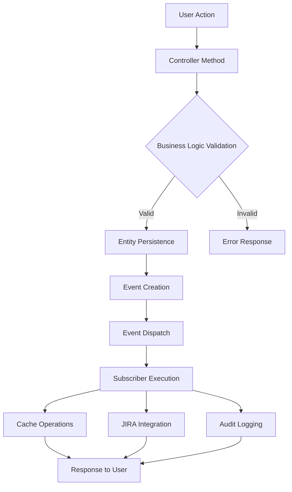

# Event System Documentation

## Overview

The TimeTracker application implements an event-driven architecture using Symfony's EventDispatcher component. This system provides a decoupled way to handle side effects and notifications when domain objects change state, particularly for time entry operations.

### Purpose of Event-Driven Architecture

The event system serves several critical purposes:

1. **Decoupling**: Separates business logic from side effects (caching, logging, external integrations)
2. **Extensibility**: Allows new features to be added without modifying existing code
3. **Observability**: Provides hooks for logging, monitoring, and auditing
4. **Integration**: Enables external system synchronization without tight coupling
5. **Testability**: Makes side effects explicit and easier to test in isolation

### Symfony EventDispatcher Integration

The system leverages Symfony's EventDispatcher component:
- Events extend `Symfony\Contracts\EventDispatcher\Event`
- Subscribers implement `EventSubscriberInterface`
- Auto-configuration via `autoconfigure: true` in services.yaml
- Priority-based subscriber execution

### Benefits for Decoupling

- **Single Responsibility**: Controllers focus on request handling, subscribers handle side effects
- **Open/Closed Principle**: New functionality can be added by creating new subscribers
- **No Circular Dependencies**: Events flow in one direction, preventing dependency cycles
- **Flexibility**: Subscribers can be enabled/disabled without affecting core business logic

## Event Classes

### EntryEvent

**Location**: `src/Event/EntryEvent.php`

The primary domain event for time entry operations, providing context about entry lifecycle changes.

#### Properties

```php
class EntryEvent extends Event
{
    public const string CREATED = 'entry.created';
    public const string UPDATED = 'entry.updated';
    public const string DELETED = 'entry.deleted';
    public const string SYNCED = 'entry.synced';
    public const string SYNC_FAILED = 'entry.sync_failed';

    private readonly Entry $entry;
    private readonly ?array $context;
}
```

#### Event Types

| Event Constant | Purpose | When Dispatched | Use Cases |
|---|---|---|---|
| `CREATED` | New entry created | After entry persistence | Cache invalidation, auto-sync to JIRA, notifications |
| `UPDATED` | Entry modified | After entry updates | Cache refresh, JIRA worklog updates, change tracking |
| `DELETED` | Entry removed | After entry deletion | Cache cleanup, JIRA worklog deletion, audit logging |
| `SYNCED` | Entry synchronized to external system | After successful JIRA sync | Clear sync flags, update status, logging |
| `SYNC_FAILED` | External sync failed | After sync attempt failure | Error logging, notification, retry scheduling |

#### Properties and Data

**Entry Object**
```php
public function getEntry(): Entry
```
- Contains the complete Entry entity with all relationships loaded
- Provides access to user, project, customer, activity, and time data
- Immutable reference to prevent accidental modifications

**Context Array**
```php
public function getContext(): ?array
```
- Optional metadata about the operation
- Common context keys:
  - `changes`: Array of field changes for UPDATE events
  - `error`: Error details for SYNC_FAILED events
  - `source`: Origin of the operation (web, api, sync)
  - `user_id`: Acting user for audit trails

#### Usage Example

```php
// Event creation and dispatch
$event = new EntryEvent(
    entry: $entry,
    context: ['changes' => ['duration' => ['old' => 60, 'new' => 90]]]
);
$this->eventDispatcher->dispatch($event, EntryEvent::UPDATED);
```

## Event Subscribers

### EntryEventSubscriber

**Location**: `src/EventSubscriber/EntryEventSubscriber.php`
**Status**: Currently excluded from service container (line 52 in services.yaml)

The primary business logic subscriber handling entry-related domain events.

#### Purpose and Responsibility

Coordinates cross-cutting concerns for entry operations:
- Query cache management for performance
- JIRA integration and synchronization
- Audit logging and monitoring
- Automatic workflow triggers

#### Events Subscribed To

```php
public static function getSubscribedEvents(): array
{
    return [
        EntryEvent::CREATED => 'onEntryCreated',
        EntryEvent::UPDATED => 'onEntryUpdated',
        EntryEvent::DELETED => 'onEntryDeleted',
        EntryEvent::SYNCED => 'onEntrySynced',
        EntryEvent::SYNC_FAILED => 'onEntrySyncFailed',
    ];
}
```

#### Dependencies

```php
public function __construct(
    private readonly JiraIntegrationService $jiraService,
    private readonly QueryCacheService $cacheService,
    private readonly ?LoggerInterface $logger = null,
) {}
```

#### Actions Performed

**Entry Created (`onEntryCreated`)**
```php
public function onEntryCreated(EntryEvent $event): void
```

1. **Audit Logging**: Records entry creation with user and entry IDs
2. **Cache Invalidation**: Clears user-specific entry cache using `QueryCacheService`
3. **Auto-sync Logic**: Checks if automatic JIRA synchronization should occur
   - Validates project has ticket system configured
   - Confirms ticket system is JIRA with auto-booking enabled
   - Ensures entry has valid ticket reference
4. **JIRA Integration**: Attempts automatic worklog creation if conditions are met
5. **Error Handling**: Logs sync failures without breaking entry creation

**Entry Updated (`onEntryUpdated`)**
```php
public function onEntryUpdated(EntryEvent $event): void
```

1. **Change Tracking**: Logs what fields were modified via context data
2. **Cache Refresh**: Invalidates stale cached queries
3. **JIRA Sync**: Updates existing JIRA worklog if entry was previously synced
   - Only updates if `syncedToTicketsystem` flag is true
   - Only updates if `worklogId` exists from previous sync
4. **Graceful Degradation**: Logs warnings on JIRA failures but doesn't block updates

**Entry Deleted (`onEntryDeleted`)**
```php
public function onEntryDeleted(EntryEvent $event): void
```

1. **Cleanup Logging**: Records deletion for audit purposes
2. **Cache Cleanup**: Removes invalidated cache entries
3. **JIRA Cleanup**: Deletes corresponding JIRA worklog if exists
   - Checks both sync flag and worklog ID
   - Prevents orphaned worklogs in external systems
4. **Error Resilience**: Warns on JIRA deletion failures but completes local deletion

**Entry Synced (`onEntrySynced`)**
```php
public function onEntrySynced(EntryEvent $event): void
```

1. **Success Logging**: Records successful sync with worklog ID
2. **Cache Management**: Clears sync-related cache tags
3. **Status Tracking**: Updates internal sync status flags

**Entry Sync Failed (`onEntrySyncFailed`)**
```php
public function onEntrySyncFailed(EntryEvent $event): void
```

1. **Error Logging**: Records failure details and error messages
2. **Future Enhancement Points**: Placeholder for retry logic or notifications

#### Auto-sync Decision Logic

```php
private function shouldAutoSync(Entry $entry): bool
```

Complex business logic determining automatic JIRA synchronization:

**Requirements Cascade**:
1. Entry must belong to a project
2. Project must have associated ticket system
3. Ticket system must be configured for automatic booking
4. Ticket system must be JIRA type
5. Entry must have valid ticket reference

**Business Rules**:
- Only JIRA ticket systems support auto-sync currently
- Ticket validation occurs before sync attempts
- Missing ticket reference prevents auto-sync
- Inactive projects skip auto-sync

### ExceptionSubscriber

**Location**: `src/EventSubscriber/ExceptionSubscriber.php`

Global exception handler providing consistent error responses and logging.

#### Purpose and Responsibility

- Convert PHP exceptions to appropriate HTTP responses
- Provide consistent error format for JSON APIs
- Environment-aware error detail exposure
- Comprehensive exception logging

#### Events Subscribed To

```php
public static function getSubscribedEvents(): array
{
    return [
        KernelEvents::EXCEPTION => ['onKernelException', 10],
    ];
}
```

**Priority**: 10 (higher priority, executes early)

#### Exception Handling Strategy

**Content-Type Detection**
```php
$acceptsJson = str_contains($request->headers->get('Accept', ''), 'application/json')
              || str_contains($request->getPathInfo(), '/api/');
```

**JIRA-Specific Exceptions**
- `JiraApiUnauthorizedException`: Returns 401 with redirect URL for OAuth flow
- `JiraApiException`: Returns 502 Bad Gateway for upstream API failures

**HTTP Exceptions**
- Preserves HTTP status codes and messages
- Provides user-friendly error descriptions
- Maps status codes to appropriate error types

**Environment-Aware Responses**
- **Development**: Full stack traces, file locations, exception details
- **Production**: Generic messages, security-focused error hiding

**Logging Strategy**
```php
private function logException(Throwable $exception, string $path): void
```

- Server errors (5xx): Error level logging
- Client errors (4xx): Warning level logging
- Includes exception class, message, file, line, and request path

### AccessDeniedSubscriber

**Location**: `src/EventSubscriber/AccessDeniedSubscriber.php`

Security-focused subscriber handling access control violations.

#### Purpose and Responsibility

- Convert `AccessDeniedException` to appropriate responses
- Distinguish between authentication and authorization failures
- Preserve user experience with appropriate redirects
- Maintain security test compatibility

#### Events Subscribed To

```php
public static function getSubscribedEvents(): array
{
    return [
        KernelEvents::EXCEPTION => ['onKernelException', 5],
    ];
}
```

**Priority**: 5 (lower than ExceptionSubscriber, more specific handling)

#### Access Control Logic

**Unauthenticated Users**
```php
if (!$this->security->getUser()) {
    $loginUrl = $this->router->generate('_login');
    $response = new RedirectResponse($loginUrl);
    $event->setResponse($response);
}
```

- Redirects to login page instead of showing 403
- Improves user experience for session timeouts
- Handles missing authentication gracefully

**Authenticated Users**
```php
$response = new Response('You are not allowed to perform this action.', Response::HTTP_FORBIDDEN);
```

- Shows explicit 403 Forbidden response
- Maintains test compatibility for authorization checks
- Clear security boundary messaging

## Event Flow

### Complete Event Lifecycle



### Dispatch Points in Controllers

Currently, the event dispatching is **implemented but not actively used** in the controllers. The infrastructure exists but requires integration.

**Expected Integration Points**:

**SaveEntryAction** (Create/Update)
```php
// After successful persistence (line 195)
$entityManager->persist($entry);
$entityManager->flush();

// MISSING: Event dispatch
$eventType = $entryId ? EntryEvent::UPDATED : EntryEvent::CREATED;
$context = $entryId ? ['changes' => $changeTracker->getChanges()] : null;
$event = new EntryEvent($entry, $context);
$this->eventDispatcher->dispatch($event, $eventType);
```

**DeleteEntryAction** (Delete)
```php
// After successful removal (line 54-55)
$manager->remove($entry);
$manager->flush();

// MISSING: Event dispatch
$event = new EntryEvent($entry);
$this->eventDispatcher->dispatch($event, EntryEvent::DELETED);
```

### Service Layer Usage

**JIRA Integration Service** (External Event Sources)
```php
// After successful JIRA sync
$event = new EntryEvent($entry, ['worklog_id' => $worklogId]);
$this->eventDispatcher->dispatch($event, EntryEvent::SYNCED);

// After sync failure
$event = new EntryEvent($entry, ['error' => $exception->getMessage()]);
$this->eventDispatcher->dispatch($event, EntryEvent::SYNC_FAILED);
```

### Subscriber Execution Order

Symfony executes subscribers based on priority (highest first):

1. **ExceptionSubscriber** (Priority: 10) - Global exception handling
2. **AccessDeniedSubscriber** (Priority: 5) - Security exception handling
3. **EntryEventSubscriber** (Priority: 0, default) - Business logic events

**Transaction Boundaries**:
- Events are dispatched **after** database transactions commit
- Ensures entity persistence before side effects
- Prevents inconsistent state if subscribers fail
- Cache invalidation occurs after data changes are durable

## Custom Events

### Creating New Events

**Event Class Structure**:
```php
<?php
declare(strict_types=1);

namespace App\Event;

use Symfony\Contracts\EventDispatcher\Event;

class ProjectEvent extends Event
{
    public const string CREATED = 'project.created';
    public const string UPDATED = 'project.updated';
    public const string ARCHIVED = 'project.archived';

    public function __construct(
        private readonly Project $project,
        private readonly ?array $context = null,
    ) {}

    public function getProject(): Project
    {
        return $this->project;
    }

    public function getContext(): ?array
    {
        return $this->context;
    }
}
```

### Naming Conventions

**Event Constants**:
- Use `SCREAMING_SNAKE_CASE` for constants
- Follow pattern: `ENTITY.ACTION` (e.g., `entry.created`)
- Use past tense verbs (`created`, `updated`, `deleted`)

**Event Classes**:
- Suffix class names with `Event` (e.g., `ProjectEvent`)
- Use singular entity names
- Place in `src/Event/` namespace

**Event Names**:
- Use dot notation: `entity.action`
- Keep names short but descriptive
- Maintain consistency across domain

**Subscriber Methods**:
- Prefix with `on` followed by entity and action
- Use camelCase: `onProjectCreated`, `onEntryUpdated`

### Best Practices

**Event Design**:
1. **Immutable Events**: Use readonly properties to prevent modification
2. **Rich Context**: Include relevant metadata in context array
3. **Entity References**: Always include the affected domain object
4. **Avoid Logic**: Events should carry data, not contain business logic

**Subscriber Design**:
1. **Single Purpose**: Each subscriber should handle one concern
2. **Error Isolation**: Don't let subscriber failures break business operations
3. **Idempotent**: Subscribers should handle duplicate events gracefully
4. **Logging**: Always log significant actions for debugging

**Performance Considerations**:
1. **Lazy Loading**: Only load data needed by subscribers
2. **Async Processing**: Consider queuing for heavy operations
3. **Batching**: Group related operations when possible
4. **Circuit Breakers**: Implement failure handling for external systems

## Integration Points

### Controller Integration

**Current State**: Controllers perform direct operations without event dispatching.

**Required Integration Steps**:

1. **Inject EventDispatcher**:
```php
use Symfony\Contracts\EventDispatcher\EventDispatcherInterface;

public function __construct(
    private readonly EventDispatcherInterface $eventDispatcher,
    // ... other dependencies
) {}
```

2. **Dispatch After Persistence**:
```php
$entityManager->persist($entry);
$entityManager->flush();

// Dispatch event after successful persistence
$event = new EntryEvent($entry, $context);
$this->eventDispatcher->dispatch($event, $eventType);
```

3. **Context Enrichment**:
```php
$context = [
    'source' => 'web',
    'user_id' => $this->getUser()->getId(),
    'ip_address' => $request->getClientIp(),
];

if ($isUpdate) {
    $context['changes'] = $this->detectChanges($originalEntry, $updatedEntry);
}
```

### Service Layer Usage

**Service Configuration**:
```php
# config/services.yaml
App\EventSubscriber\EntryEventSubscriber:
    # Currently excluded - remove from exclusion list
    public: true
    autowire: true
    autoconfigure: true
```

**Service Integration**:
```php
use Symfony\Contracts\EventDispatcher\EventDispatcherInterface;

class EntryService
{
    public function __construct(
        private readonly EventDispatcherInterface $eventDispatcher,
    ) {}

    public function createEntry(EntryDto $dto): Entry
    {
        // Business logic...
        $entry = new Entry();
        // ... populate entry

        $this->entityManager->persist($entry);
        $this->entityManager->flush();

        // Dispatch domain event
        $event = new EntryEvent($entry);
        $this->eventDispatcher->dispatch($event, EntryEvent::CREATED);

        return $entry;
    }
}
```

### Testing Events

**Unit Testing Subscribers**:
```php
use PHPUnit\Framework\TestCase;
use App\Event\EntryEvent;
use App\EventSubscriber\EntryEventSubscriber;

class EntryEventSubscriberTest extends TestCase
{
    public function testEntryCreatedInvalidatesCache(): void
    {
        $cacheService = $this->createMock(QueryCacheService::class);
        $cacheService->expects($this->once())
                    ->method('invalidateEntity')
                    ->with(Entry::class, 123);

        $subscriber = new EntryEventSubscriber(
            jiraService: $this->createMock(JiraIntegrationService::class),
            cacheService: $cacheService,
        );

        $entry = $this->createEntryWithUser(123);
        $event = new EntryEvent($entry);

        $subscriber->onEntryCreated($event);
    }
}
```

**Integration Testing Events**:
```php
use Symfony\Bundle\FrameworkBundle\Test\KernelTestCase;

class EventIntegrationTest extends KernelTestCase
{
    public function testEntryCreationDispatchesEvent(): void
    {
        $eventDispatcher = static::getContainer()->get('event_dispatcher');

        $dispatchedEvents = [];
        $listener = function(EntryEvent $event, string $eventName) use (&$dispatchedEvents) {
            $dispatchedEvents[$eventName] = $event;
        };

        $eventDispatcher->addListener(EntryEvent::CREATED, $listener);

        // Trigger entry creation
        $this->createEntry();

        $this->assertArrayHasKey(EntryEvent::CREATED, $dispatchedEvents);
    }
}
```

**Event Mocking**:
```php
public function testControllerWithMockedEvents(): void
{
    $eventDispatcher = $this->createMock(EventDispatcherInterface::class);
    $eventDispatcher->expects($this->once())
                   ->method('dispatch')
                   ->with(
                       $this->isInstanceOf(EntryEvent::class),
                       EntryEvent::CREATED
                   );

    // Inject mock into controller/service
    $controller = new SaveEntryAction($eventDispatcher, /* ... */);
}
```

## Implementation Status

### Current State

**✅ Implemented**:
- Event classes with proper constants and structure
- Event subscriber interfaces and business logic
- Exception handling subscribers
- Auto-configuration infrastructure

**❌ Missing Integration**:
- Controller event dispatching (not yet connected)
- Service container registration (EntryEventSubscriber excluded)
- Change detection for UPDATE events
- Async/queued event processing

**⚠️ Configuration Issues**:
- `EntryEventSubscriber` excluded in `services.yaml` line 52
- No event dispatcher injection in controllers
- No context enrichment in business operations

### Next Steps for Full Implementation

1. **Enable EntryEventSubscriber**: Remove exclusion from services.yaml
2. **Controller Integration**: Add EventDispatcher injection and dispatch calls
3. **Change Detection**: Implement before/after comparison for updates
4. **Error Handling**: Add circuit breakers for external service failures
5. **Performance**: Consider async processing for heavy operations
6. **Testing**: Add comprehensive event integration tests
7. **Documentation**: Update API docs with event behavior
8. **Monitoring**: Add metrics for event processing success/failure rates

The event system foundation is solid and follows Symfony best practices. With proper integration, it will provide robust decoupling and extensibility for the TimeTracker application.