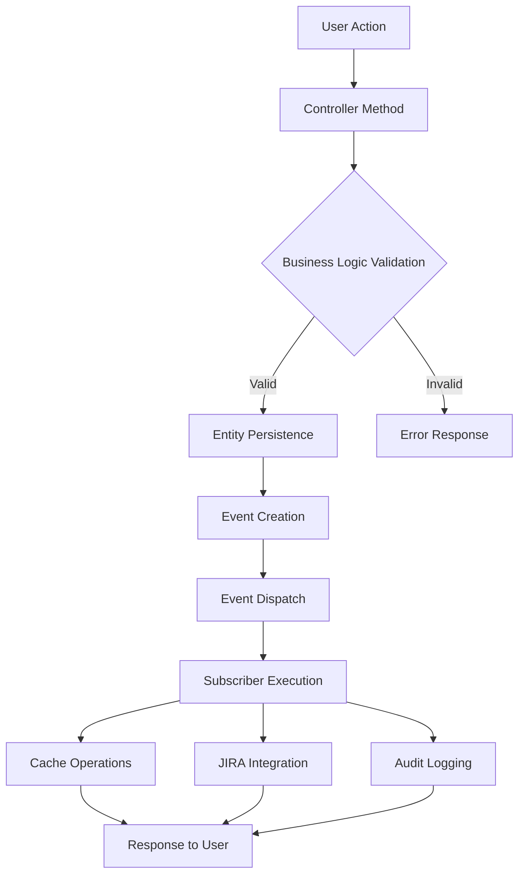

# Event System Documentation

## Overview

The TimeTracker application implements an event-driven architecture using Symfony's EventDispatcher component. This system provides a decoupled way to handle side effects and notifications when domain objects change state, particularly for time entry operations.

### Purpose of Event-Driven Architecture

The event system serves several critical purposes:

1. **Decoupling**: Separates business logic from side effects (caching, logging, external integrations)
2. **Extensibility**: Allows new features to be added without modifying existing code
3. **Observability**: Provides hooks for logging, monitoring, and auditing
4. **Integration**: Enables external system synchronization without tight coupling
5. **Testability**: Makes side effects explicit and easier to test in isolation

### Symfony EventDispatcher Integration

The system leverages Symfony's EventDispatcher component:
- Events extend `Symfony\Contracts\EventDispatcher\Event`
- Subscribers implement `EventSubscriberInterface`
- Auto-configuration via `autoconfigure: true` in services.yaml
- Priority-based subscriber execution

### Benefits for Decoupling

- **Single Responsibility**: Controllers focus on request handling, subscribers handle side effects
- **Open/Closed Principle**: New functionality can be added by creating new subscribers
- **No Circular Dependencies**: Events flow in one direction, preventing dependency cycles
- **Flexibility**: Subscribers can be enabled/disabled without affecting core business logic

## Event Classes

### EntryEvent

**Location**: `src/Event/EntryEvent.php`

The primary domain event for time entry operations, providing context about entry lifecycle changes.

#### Properties

```php
class EntryEvent extends Event
{
    public const string CREATED = 'entry.created';
    public const string UPDATED = 'entry.updated';
    public const string DELETED = 'entry.deleted';
    public const string SYNCED = 'entry.synced';
    public const string SYNC_FAILED = 'entry.sync_failed';

    private readonly Entry $entry;
    private readonly ?array $context;
}
```

#### Event Types

| Event Constant | Purpose | When Dispatched | Use Cases |
|---|---|---|---|
| `CREATED` | New entry created | After entry persistence | Cache invalidation, auto-sync to JIRA, notifications |
| `UPDATED` | Entry modified | After entry updates | Cache refresh, JIRA worklog updates, change tracking |
| `DELETED` | Entry removed | After entry deletion | Cache cleanup, JIRA worklog deletion, audit logging |
| `SYNCED` | Entry synchronized to external system | After successful JIRA sync | Clear sync flags, update status, logging |
| `SYNC_FAILED` | External sync failed | After sync attempt failure | Error logging, notification, retry scheduling |

#### Properties and Data

**Entry Object**
```php
public function getEntry(): Entry
```
- Contains the complete Entry entity with all relationships loaded
- Provides access to user, project, customer, activity, and time data
- Immutable reference to prevent accidental modifications

**Context Array**
```php
public function getContext(): ?array
```
- Optional metadata about the operation
- Context keys actually used by the code:
  - `previous`: The pre-mutation `Entry` snapshot, passed on `CREATED`/`UPDATED` from `SaveEntryAction`; the subscriber reads it via `getPreviousEntry()` to clean up the old Jira worklog when a ticket changes
  - `exception`: The `Throwable` read by `onEntrySyncFailed()` for `SYNC_FAILED` logging

#### Usage Example

```php
// Event creation and dispatch (see SaveEntryAction::persistEntry)
$eventName = $isNewEntry ? EntryEvent::CREATED : EntryEvent::UPDATED;
$this->eventDispatcher->dispatch(
    new EntryEvent($entry, ['previous' => $previousEntry]),
    $eventName,
);
```

## Event Subscribers

### EntryEventSubscriber

**Location**: `src/EventSubscriber/EntryEventSubscriber.php`
**Status**: Registered and active. It is auto-wired/auto-configured via the `App\:` resource loader in `config/services.yaml` (only `ProfilerAdminGateSubscriber` is excluded among the subscribers; line 52's exclusion targets `JiraIntegrationService`, a different class). Implementing `EventSubscriberInterface` means Symfony tags it as an event subscriber automatically.

The primary business logic subscriber handling entry-related domain events.

#### Purpose and Responsibility

Coordinates cross-cutting concerns for entry operations:
- Query cache management for performance
- JIRA integration and synchronization
- Audit logging and monitoring
- Automatic workflow triggers

#### Events Subscribed To

```php
public static function getSubscribedEvents(): array
{
    return [
        EntryEvent::CREATED => 'onEntryCreated',
        EntryEvent::UPDATED => 'onEntryUpdated',
        EntryEvent::DELETED => 'onEntryDeleted',
        EntryEvent::SYNCED => 'onEntrySynced',
        EntryEvent::SYNC_FAILED => 'onEntrySyncFailed',
    ];
}
```

#### Dependencies

```php
public function __construct(
    private readonly JiraOAuthApiFactory $jiraOAuthApiFactory,
    private readonly ManagerRegistry $managerRegistry,
    private readonly QueryCacheService $queryCacheService,
    private readonly ?LoggerInterface $logger = null,
) {}
```

> Worklog sync deliberately uses the legacy `JiraOAuthApiService` (via `JiraOAuthApiFactory`) — it is the only Jira integration path wired into the container. The newer `JiraIntegrationService` stack stays excluded until token encryption is production-ready.

#### Actions Performed

**Entry Created (`onEntryCreated`)**
```php
public function onEntryCreated(EntryEvent $event): void
```

1. **Audit Logging**: Records entry creation with user and entry IDs
2. **Cache Invalidation**: Clears user-specific entry cache using `QueryCacheService`
3. **Auto-sync Logic**: Checks if automatic JIRA synchronization should occur
   - Validates project has ticket system configured
   - Confirms ticket system is JIRA with auto-booking enabled
   - Ensures entry has valid ticket reference
4. **JIRA Integration**: Attempts automatic worklog creation if conditions are met
5. **Error Handling**: Logs sync failures without breaking entry creation

**Entry Updated (`onEntryUpdated`)**
```php
public function onEntryUpdated(EntryEvent $event): void
```

1. **Logging**: Records the update
2. **Cache Refresh**: Invalidates stale cached queries via `QueryCacheService`
3. **JIRA Sync**: Runs `syncWorklog()` on every update when `shouldAutoSync()` passes (v4 parity). `updateEntryJiraWorkLog` creates a new worklog or updates the existing one based on the worklog id, so entries never synced before are caught up on their next save. If the ticket changed and the previous entry had a worklog id, the old worklog is deleted first (using the `previous` snapshot).
4. **Graceful Degradation**: Logs warnings on JIRA failures but doesn't block updates

**Entry Deleted (`onEntryDeleted`)**
```php
public function onEntryDeleted(EntryEvent $event): void
```

1. **Cleanup Logging**: Records deletion for audit purposes
2. **Cache Cleanup**: Removes invalidated cache entries
3. **JIRA Cleanup**: Deletes corresponding JIRA worklog if exists
   - Checks both sync flag and worklog ID
   - Prevents orphaned worklogs in external systems
4. **Error Resilience**: Warns on JIRA deletion failures but completes local deletion

**Entry Synced (`onEntrySynced`)**
```php
public function onEntrySynced(EntryEvent $event): void
```

1. **Success Logging**: Records successful sync with worklog ID
2. **Cache Management**: Clears sync-related cache tags
3. **Status Tracking**: Updates internal sync status flags

**Entry Sync Failed (`onEntrySyncFailed`)**
```php
public function onEntrySyncFailed(EntryEvent $event): void
```

1. **Error Logging**: Records failure details and error messages
2. **Future Enhancement Points**: Placeholder for retry logic or notifications

#### Auto-sync Decision Logic

```php
private function shouldAutoSync(Entry $entry): bool
```

`shouldAutoSync()` is a cheap gate; the real per-target decision is made in `syncWorklog()` via `canBookOn()`.

**`shouldAutoSync()` returns true only when all hold**:
1. The entry belongs to a `Project`
2. The entry has a `User` (the Jira client acts on their behalf)
3. The ticket is not empty (`not in ['', '0']`)
4. At least one bookable target exists: the project has its own ticket system **or** an internal Jira project key (`Project::hasInternalJiraProjectKey()`)

**Per-target gate (`canBookOn()`)**: a ticket system is only booked to when `getBookTime()` is true **and** its type is `TicketSystemType::JIRA`.

**Internal Jira mirroring**: for projects with an internal Jira project key, `syncWorklog()` mirrors the external ticket into the internal Jira (finds the issue by summary or creates it), rewrites the entry's ticket to the internal issue key, and preserves the external key in `internalJiraTicketOriginalKey` ("ext. ticket") — matching v4's internal-ticket-system behavior.

### ExceptionSubscriber

**Location**: `src/EventSubscriber/ExceptionSubscriber.php`

Global exception handler providing consistent error responses and logging.

#### Purpose and Responsibility

- Convert PHP exceptions to appropriate HTTP responses
- Provide consistent error format for JSON APIs
- Environment-aware error detail exposure
- Comprehensive exception logging

#### Events Subscribed To

```php
public static function getSubscribedEvents(): array
{
    return [
        KernelEvents::EXCEPTION => ['onKernelException', 10],
    ];
}
```

**Priority**: 10 (higher priority, executes early)

#### Exception Handling Strategy

**Content-Type Detection**
```php
$acceptsJson = str_contains($request->headers->get('Accept', ''), 'application/json')
              || str_contains($request->getPathInfo(), '/api/');
```

**JIRA-Specific Exceptions**
- `JiraApiUnauthorizedException`: Returns 401 with redirect URL for OAuth flow
- `JiraApiException`: Returns 502 Bad Gateway for upstream API failures

**HTTP Exceptions**
- Preserves HTTP status codes and messages
- Provides user-friendly error descriptions
- Maps status codes to appropriate error types

**Environment-Aware Responses**
- **Development**: Full stack traces, file locations, exception details
- **Production**: Generic messages, security-focused error hiding

**Logging Strategy**
```php
private function logException(Throwable $exception, string $path): void
```

- Server errors (5xx): Error level logging
- Client errors (4xx): Warning level logging
- Includes exception class, message, file, line, and request path

### AccessDeniedSubscriber

**Location**: `src/EventSubscriber/AccessDeniedSubscriber.php`

Security-focused subscriber handling access control violations.

#### Purpose and Responsibility

- Convert `AccessDeniedException` to appropriate responses
- Distinguish between authentication and authorization failures
- Preserve user experience with appropriate redirects
- Maintain security test compatibility

#### Events Subscribed To

```php
public static function getSubscribedEvents(): array
{
    return [
        KernelEvents::EXCEPTION => ['onKernelException', 5],
    ];
}
```

**Priority**: 5 (lower than ExceptionSubscriber, more specific handling)

#### Access Control Logic

**Unauthenticated Users**
```php
if (!$this->security->getUser()) {
    $loginUrl = $this->router->generate('_login');
    $response = new RedirectResponse($loginUrl);
    $event->setResponse($response);
}
```

- Redirects to login page instead of showing 403
- Improves user experience for session timeouts
- Handles missing authentication gracefully

**Authenticated Users**
```php
$response = new Response('You are not allowed to perform this action.', Response::HTTP_FORBIDDEN);
```

- Shows explicit 403 Forbidden response
- Maintains test compatibility for authorization checks
- Clear security boundary messaging

## Event Flow

### Complete Event Lifecycle


```mermaid
graph TD
    A[User Action] --> B[Controller Method]
    B --> C{Business Logic Validation}
    C -->|Valid| D[Entity Persistence]
    C -->|Invalid| E[Error Response]
    D --> F[Event Creation]
    F --> G[Event Dispatch]
    G --> H[Subscriber Execution]
    H --> I[Cache Operations]
    H --> J[JIRA Integration]
    H --> K[Audit Logging]
    I --> L[Response to User]
    J --> L
    K --> L
```

### Dispatch Points in Controllers

Entry events **are dispatched** from the tracking controllers, after the entity is persisted and flushed.

**SaveEntryAction** (Create/Update) — `persistEntry()`
```php
$entityManager->persist($entry);
$entityManager->flush();

// Dispatch entry event for Jira sync and cache invalidation
if ($this->eventDispatcher instanceof EventDispatcherInterface) {
    $eventName = $isNewEntry ? EntryEvent::CREATED : EntryEvent::UPDATED;
    $this->eventDispatcher->dispatch(
        new EntryEvent($entry, ['previous' => $previousEntry]),
        $eventName,
    );
}
```

**DeleteEntryAction** (Delete)
```php
// After successful removal
$this->eventDispatcher->dispatch(new EntryEvent($entry), EntryEvent::DELETED);
```

**BulkEntryAction** (bulk create) dispatches `EntryEvent::CREATED` for each generated entry.

### SYNCED / SYNC_FAILED events

`EntryEvent::SYNCED` and `EntryEvent::SYNC_FAILED` are defined constants, and `EntryEventSubscriber` subscribes to both (`onEntrySynced` invalidates the `jira_sync` cache tag; `onEntrySyncFailed` logs the `Throwable` in `context['exception']`). **No component currently dispatches them** — the worklog booking runs inline inside `onEntryCreated`/`onEntryUpdated`, so these two hooks are wired but presently dormant. If a dedicated sync service is added, it would dispatch them like:

```php
// After successful JIRA sync
$this->eventDispatcher->dispatch(new EntryEvent($entry), EntryEvent::SYNCED);

// After sync failure
$this->eventDispatcher->dispatch(
    new EntryEvent($entry, ['exception' => $exception]),
    EntryEvent::SYNC_FAILED,
);
```

### Subscriber Execution Order

Only the two exception subscribers share an event (`KernelEvents::EXCEPTION`), so ordering applies to them (highest priority first):

1. **AccessDeniedSubscriber** (Priority: 15) - Security exception handling (runs first, converts `AccessDeniedException` before the generic handler)
2. **ExceptionSubscriber** (Priority: 10) - Global exception handling

`EntryEventSubscriber` listens to the custom `entry.*` events (not `KernelEvents::EXCEPTION`), so it is on a separate dispatch path and does not compete with the exception subscribers for ordering.

**Transaction Boundaries**:
- Events are dispatched **after** database transactions commit
- Ensures entity persistence before side effects
- Prevents inconsistent state if subscribers fail
- Cache invalidation occurs after data changes are durable

## Custom Events

### Creating New Events

**Event Class Structure**:
```php
<?php
declare(strict_types=1);

namespace App\Event;

use Symfony\Contracts\EventDispatcher\Event;

class ProjectEvent extends Event
{
    public const string CREATED = 'project.created';
    public const string UPDATED = 'project.updated';
    public const string ARCHIVED = 'project.archived';

    public function __construct(
        private readonly Project $project,
        private readonly ?array $context = null,
    ) {}

    public function getProject(): Project
    {
        return $this->project;
    }

    public function getContext(): ?array
    {
        return $this->context;
    }
}
```

### Naming Conventions

**Event Constants**:
- Use `SCREAMING_SNAKE_CASE` for constants
- Follow pattern: `ENTITY.ACTION` (e.g., `entry.created`)
- Use past tense verbs (`created`, `updated`, `deleted`)

**Event Classes**:
- Suffix class names with `Event` (e.g., `ProjectEvent`)
- Use singular entity names
- Place in `src/Event/` namespace

**Event Names**:
- Use dot notation: `entity.action`
- Keep names short but descriptive
- Maintain consistency across domain

**Subscriber Methods**:
- Prefix with `on` followed by entity and action
- Use camelCase: `onProjectCreated`, `onEntryUpdated`

### Best Practices

**Event Design**:
1. **Immutable Events**: Use readonly properties to prevent modification
2. **Rich Context**: Include relevant metadata in context array
3. **Entity References**: Always include the affected domain object
4. **Avoid Logic**: Events should carry data, not contain business logic

**Subscriber Design**:
1. **Single Purpose**: Each subscriber should handle one concern
2. **Error Isolation**: Don't let subscriber failures break business operations
3. **Idempotent**: Subscribers should handle duplicate events gracefully
4. **Logging**: Always log significant actions for debugging

**Performance Considerations**:
1. **Lazy Loading**: Only load data needed by subscribers
2. **Async Processing**: Consider queuing for heavy operations
3. **Batching**: Group related operations when possible
4. **Circuit Breakers**: Implement failure handling for external systems

## Integration Points

### Controller Integration

**Current State**: The tracking controllers (`SaveEntryAction`, `DeleteEntryAction`, `BulkEntryAction`) inject `EventDispatcherInterface` and dispatch `EntryEvent`s after persistence.

1. **Inject EventDispatcher** (constructor autowiring):
```php
use Symfony\Contracts\EventDispatcher\EventDispatcherInterface;

public function __construct(
    private readonly EventDispatcherInterface $eventDispatcher,
    // ... other dependencies
) {}
```

2. **Dispatch After Persistence**:
```php
$entityManager->persist($entry);
$entityManager->flush();

// Dispatch after the flush so the entity is durable before side effects
$eventName = $isNewEntry ? EntryEvent::CREATED : EntryEvent::UPDATED;
$this->eventDispatcher->dispatch(new EntryEvent($entry, ['previous' => $previousEntry]), $eventName);
```

3. **Context**: the only context key passed today is `previous` (the pre-mutation `Entry` snapshot on update). Richer context (source, acting user, change diffs) is not currently populated.

### Service Layer Usage

**Service Configuration**: `EntryEventSubscriber` needs no explicit service definition — it is picked up by the `App\:` resource loader in `config/services.yaml` (autowire + autoconfigure), and implementing `EventSubscriberInterface` gets it tagged as a subscriber automatically. Only `ProfilerAdminGateSubscriber` is excluded there (it is registered in the `profiling` env only).

**Service Integration**:
```php
use Symfony\Contracts\EventDispatcher\EventDispatcherInterface;

class EntryService
{
    public function __construct(
        private readonly EventDispatcherInterface $eventDispatcher,
    ) {}

    public function createEntry(EntryDto $dto): Entry
    {
        // Business logic...
        $entry = new Entry();
        // ... populate entry

        $this->entityManager->persist($entry);
        $this->entityManager->flush();

        // Dispatch domain event
        $event = new EntryEvent($entry);
        $this->eventDispatcher->dispatch($event, EntryEvent::CREATED);

        return $entry;
    }
}
```

### Testing Events

**Unit Testing Subscribers**:
```php
use PHPUnit\Framework\TestCase;
use App\Event\EntryEvent;
use App\EventSubscriber\EntryEventSubscriber;

class EntryEventSubscriberTest extends TestCase
{
    public function testEntryCreatedInvalidatesCache(): void
    {
        $cacheService = $this->createMock(QueryCacheService::class);
        $cacheService->expects($this->once())
                    ->method('invalidateEntity')
                    ->with(Entry::class, 123);

        $subscriber = new EntryEventSubscriber(
            jiraService: $this->createMock(JiraIntegrationService::class),
            cacheService: $cacheService,
        );

        $entry = $this->createEntryWithUser(123);
        $event = new EntryEvent($entry);

        $subscriber->onEntryCreated($event);
    }
}
```

**Integration Testing Events**:
```php
use Symfony\Bundle\FrameworkBundle\Test\KernelTestCase;

class EventIntegrationTest extends KernelTestCase
{
    public function testEntryCreationDispatchesEvent(): void
    {
        $eventDispatcher = static::getContainer()->get('event_dispatcher');

        $dispatchedEvents = [];
        $listener = function(EntryEvent $event, string $eventName) use (&$dispatchedEvents) {
            $dispatchedEvents[$eventName] = $event;
        };

        $eventDispatcher->addListener(EntryEvent::CREATED, $listener);

        // Trigger entry creation
        $this->createEntry();

        $this->assertArrayHasKey(EntryEvent::CREATED, $dispatchedEvents);
    }
}
```

**Event Mocking**:
```php
public function testControllerWithMockedEvents(): void
{
    $eventDispatcher = $this->createMock(EventDispatcherInterface::class);
    $eventDispatcher->expects($this->once())
                   ->method('dispatch')
                   ->with(
                       $this->isInstanceOf(EntryEvent::class),
                       EntryEvent::CREATED
                   );

    // Inject mock into controller/service
    $controller = new SaveEntryAction($eventDispatcher, /* ... */);
}
```

## Implementation Status

### Current State

**✅ Implemented and active**:
- Event classes with proper constants and structure
- `EntryEventSubscriber` registered (auto-wired/auto-configured) and handling `CREATED`/`UPDATED`/`DELETED`
- Controller dispatching wired in `SaveEntryAction`, `DeleteEntryAction`, `BulkEntryAction` (after `flush()`)
- Jira worklog sync + user-entry cache invalidation on entry create/update/delete
- Exception handling subscribers (`AccessDeniedSubscriber`, `ExceptionSubscriber`)

**⚠️ Wired but dormant**:
- `SYNCED` / `SYNC_FAILED` are subscribed to but not dispatched by any component today
- Context is limited to the `previous` snapshot; no source/user/change-diff enrichment
- No async/queued event processing (subscribers run synchronously within the request)

### Possible Next Steps

1. **Dispatch SYNCED/SYNC_FAILED**: emit them from a dedicated sync path so the dormant hooks fire
2. **Richer context**: add change diffs / source / acting-user metadata where useful
3. **Performance**: consider async processing (Messenger) for heavy Jira operations
4. **Testing**: expand event integration tests
5. **Monitoring**: add metrics for event processing success/failure rates

The event system is active and follows Symfony best practices, providing decoupling between entry persistence and its Jira/caching side effects.