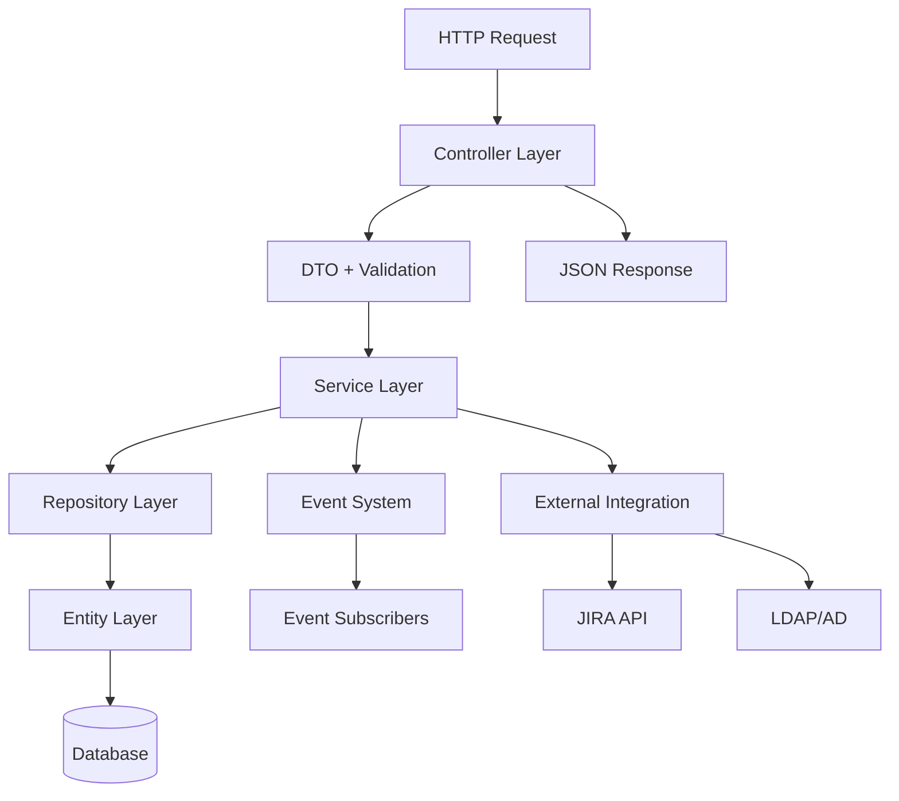

# TimeTracker Project Index

> Comprehensive documentation index for the Netresearch TimeTracker application
> Last Updated: September 14, 2025

## 📚 Quick Navigation

| Documentation | Description | Components |
|--------------|-------------|------------|
| [Controller Index](./CONTROLLER_INDEX.md) | HTTP endpoints and request handling | 58 controllers across 7 domains |
| [Service Index](./SERVICE_INDEX.md) | Business logic and integrations | 22 services across 8 categories |
| [Entity Index](./ENTITY_INDEX.md) | Database schema and relationships | 14 entities with full ORM mapping |
| [API Documentation](./API_DOCUMENTATION.md) | REST API endpoints and usage | Complete API reference |
| [Testing Guide](./TESTING_GUIDE.md) | Test suite documentation | Unit, integration, and functional tests |
| [Developer Onboarding](./DEVELOPER_ONBOARDING_GUIDE.md) | Getting started guide | Setup and development workflow |
| [Security Guide](./SECURITY_IMPLEMENTATION_GUIDE.md) | Security implementation | CSRF, authentication, authorization |

## 🏗️ Architecture Overview

```
TimeTracker Application
├── Controllers (58)      # Single Action Controllers
├── Services (22)         # Stateless business logic
├── Entities (14)         # Doctrine ORM entities
├── Repositories (14)     # Data access layer
├── DTOs                  # Data transfer objects
├── Events                # Event-driven architecture
└── Security              # Authentication & authorization
```

## 🎯 Component Matrix

### By Feature Domain

| Domain | Controllers | Services | Entities | Purpose |
|--------|------------|----------|----------|---------|
| **Time Tracking** | 4 | 3 | 1 (Entry) | Core time entry management |
| **User Management** | 3 | 2 | 2 (User, Team) | User and team administration |
| **Project Management** | 4 | 1 | 3 (Customer, Project, Activity) | Business organization |
| **Reporting** | 9 | 2 | - | Analytics and interpretation |
| **Administration** | 25 | - | 5+ | System configuration |
| **Integration** | - | 9 | 2 (TicketSystem, Holiday) | External systems (JIRA, LDAP) |
| **Export/Import** | 2 | 1 | - | Data export functionality |

### By Technology Stack

| Layer | Technology | Count | Pattern |
|-------|------------|-------|---------|
| **Framework** | Symfony 7.3 | - | MVC with Single Action Controllers |
| **Database** | MariaDB/MySQL | 14 tables | Doctrine ORM 3 |
| **Authentication** | LDAP/AD | 2 services | Symfony Security |
| **Frontend** | Twig + JavaScript | 30+ templates | Server-side rendering |
| **Testing** | PHPUnit 12 | 366 tests | Unit + Integration |
| **Quality** | PHPStan Level 8 | - | Static analysis |

## 📋 Feature Capabilities

### Core Features
- ✅ **Time Tracking**: Manual entry, bulk entry, autocompletion
- ✅ **Project Hierarchy**: Customer → Project → Activity structure
- ✅ **Team Management**: Multi-tenant access control
- ✅ **Reporting**: 9 different analytical views
- ✅ **JIRA Integration**: Bidirectional sync with OAuth
- ✅ **LDAP Authentication**: Active Directory integration
- ✅ **Export**: CSV and XLSX formats
- ✅ **Multi-role System**: DEV, CTL, PL roles

### Technical Features
- ✅ **RESTful API**: JSON request/response
- ✅ **CSRF Protection**: Stateless implementation
- ✅ **DTO Validation**: Symfony constraints
- ✅ **Event System**: Decoupled architecture
- ✅ **Service Layer**: Business logic isolation
- ✅ **Repository Pattern**: Data access abstraction
- ✅ **Docker Development**: Containerized environment

## 🔄 Data Flow Architecture



## 📁 Directory Structure

```
src/
├── Controller/          # 58 Single Action Controllers
│   ├── Admin/          # 25 administration actions
│   ├── Tracking/       # 4 time tracking actions
│   ├── Interpretation/ # 9 reporting actions
│   ├── Default/        # 16 general actions
│   └── [Others]        # Security, Settings, Status, Controlling
│
├── Service/            # 22 Business Services
│   ├── Integration/    # External system integrations
│   │   └── Jira/      # JIRA API (7 services)
│   ├── Ldap/          # LDAP authentication (2 services)
│   ├── Response/      # Response handling (2 services)
│   ├── Util/          # Utilities (3 services)
│   └── [Core]         # Validation, Export, Clock, etc.
│
├── Entity/            # 14 Doctrine Entities
│   ├── Entry.php      # Core time tracking
│   ├── User.php       # System users
│   ├── Customer.php   # Client organizations
│   ├── Project.php    # Customer projects
│   └── [Others]       # Activity, Team, Contract, etc.
│
├── Repository/        # 14 Entity Repositories
├── Dto/              # Data Transfer Objects
├── Event/            # Event classes
├── EventSubscriber/  # Event listeners
├── Security/         # Authentication/Authorization
├── Exception/        # Custom exceptions
└── Util/            # Utility classes
```

## 🔗 Cross-References

### Controller → Service Dependencies
- **SaveEntryAction** → ValidationService, EntryService
- **Admin controllers** → Various entity services
- **Interpretation controllers** → Reporting services
- **SecurityController** → LdapService

### Service → Repository Dependencies
- **EntryService** → EntryRepository
- **JiraService** → TicketSystemRepository
- **SubticketSyncService** → ProjectRepository

### Entity Relationships
- **Entry** → User, Customer, Project, Activity (many-to-one)
- **Project** → Customer (many-to-one)
- **User** ↔ Team (many-to-many)
- **Customer** → Projects, Contracts (one-to-many)

## 📊 Statistics

| Metric | Count | Details |
|--------|-------|---------|
| **Total Controllers** | 58 | Single Action pattern |
| **Total Services** | 22 | Stateless design |
| **Total Entities** | 14 | Doctrine ORM |
| **Total Tests** | 366 | All passing |
| **Code Coverage** | ~70% | Critical paths covered |
| **PHPStan Level** | 8 | Maximum strictness |
| **Lines of Code** | ~15,000 | PHP source only |

## 🚀 Quick Start Commands

```bash
# Development
make up                  # Start environment
make down               # Stop environment
make sh                 # Shell into container

# Quality Checks
make check-all          # Run all checks
make stan              # PHPStan analysis
make test              # Run test suite
make cs-fix            # Fix code style

# Documentation
make swagger           # Generate API docs
```

## 📖 Related Documentation

### Internal Docs
- [Configuration Guide](./configuration.md)
- [Development Guide](./development.md)
- [Features Overview](./features.md)
- [PHPUnit Customization](./DEVELOPER_PHPUNIT_CUSTOMIZATION.md)

### External Resources
- [Symfony 7.3 Documentation](https://symfony.com/doc/7.3/index.html)
- [Doctrine ORM Documentation](https://www.doctrine-project.org/projects/orm.html)
- [PHPUnit Documentation](https://phpunit.de/documentation.html)

## 🔄 Maintenance Status

| Component | Status | Last Updated | Notes |
|-----------|--------|--------------|-------|
| Controllers | ✅ Active | Sept 2025 | Migrating to DTO pattern |
| Services | ✅ Active | Sept 2025 | Validation architecture updated |
| Entities | ✅ Stable | Sept 2025 | Schema stable |
| Tests | ✅ Passing | Sept 2025 | 366 tests, all green |
| Documentation | ✅ Current | Sept 14, 2025 | Comprehensive index created |

---

*This index provides navigation to all technical documentation for the TimeTracker application. For specific implementation details, refer to the individual documentation files linked above.*