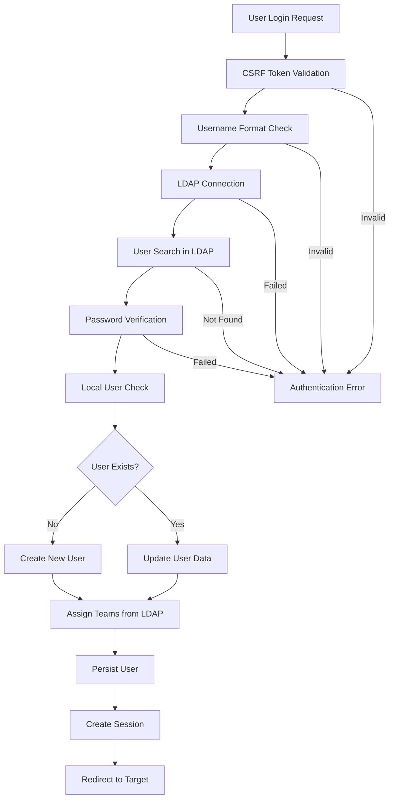
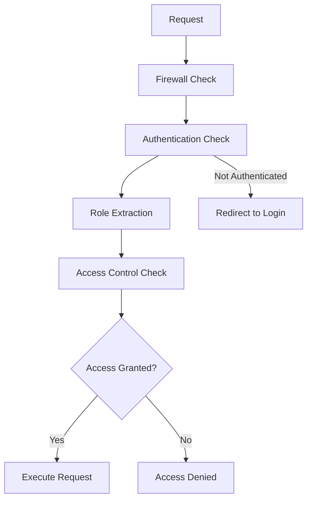
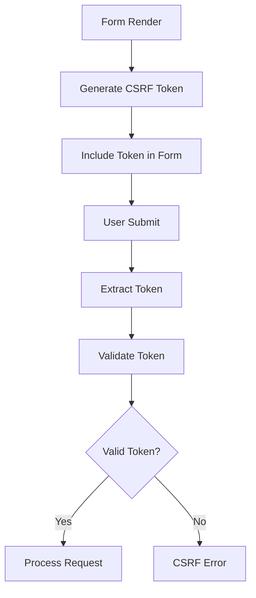

# TimeTracker Security Documentation

## Table of Contents
1. [Security Architecture Overview](#security-architecture-overview)
2. [Authentication System](#authentication-system)
3. [Authorization Model](#authorization-model)
4. [CSRF Protection](#csrf-protection)
5. [Security Components](#security-components)
6. [Configuration Analysis](#configuration-analysis)
7. [Security Best Practices](#security-best-practices)
8. [Flow Diagrams](#flow-diagrams)

## Security Architecture Overview

TimeTracker implements a comprehensive security architecture built on Symfony Security components with the following key features:

- **LDAP-based Authentication**: Users authenticate against an external LDAP server
- **Role-based Authorization**: Hierarchical role system (DEV → PL → ADMIN)
- **Stateless CSRF Protection**: Token-based protection for forms and sensitive operations
- **Encrypted Token Storage**: AES-256-GCM encryption for sensitive tokens
- **Session Management**: Secure session handling with remember-me functionality
- **Input Sanitization**: LDAP injection prevention and username validation

### Security Layers

```
┌─────────────────────────────────────────┐
│           Web Layer                     │
├─────────────────────────────────────────┤
│         CSRF Protection                 │
├─────────────────────────────────────────┤
│       Firewall Security                 │
├─────────────────────────────────────────┤
│     LDAP Authentication                 │
├─────────────────────────────────────────┤
│      Role Authorization                 │
├─────────────────────────────────────────┤
│       Entity Security                   │
├─────────────────────────────────────────┤
│       Data Layer                       │
└─────────────────────────────────────────┘
```

## Authentication System

### LDAP Integration

The authentication system is built around LDAP integration using the `LdapAuthenticator` class:

**Key Features:**
- External LDAP server authentication
- Automatic user creation on first login (configurable)
- Team assignment from LDAP organizational units
- Secure credential handling
- Comprehensive error logging

**Authentication Flow:**
```
1. User submits login form with credentials
2. CSRF token validation
3. Username format validation
4. LDAP connection establishment
5. User search in LDAP directory
6. Password verification via LDAP bind
7. Local user creation/retrieval
8. Team assignment from LDAP OU mapping
9. Session establishment
10. Redirect to target path
```

### LDAP Configuration

LDAP settings are managed via environment variables:

```yaml
# Example LDAP configuration
ldap_host: "ldap.example.com"
ldap_port: 389
ldap_usessl: true
ldap_readuser: "cn=readonly,dc=example,dc=com"
ldap_readpass: "password"
ldap_basedn: "ou=users,dc=example,dc=com"
ldap_usernamefield: "sAMAccountName"
ldap_create_user: true
```

### User Creation Process

When `ldap_create_user` is enabled:

1. **LDAP Authentication**: Verify credentials against LDAP
2. **Local User Creation**: Create User entity with default settings
3. **Team Assignment**: Map LDAP OUs to local teams via YAML configuration
4. **Database Persistence**: Save new user to database

**Default User Settings:**
- Type: `DEV` (Developer role)
- Locale: `de` (German)
- Teams: Mapped from LDAP OU structure

### Team Mapping

Team assignment uses a YAML configuration file (`config/ldap_ou_team_mapping.yml`):

```yaml
# Example team mapping
development: "Development Team"
qa: "Quality Assurance"
management: "Management"
```

## Authorization Model

### User Types and Roles

TimeTracker uses a hierarchical user type system defined in the `UserType` enum:

| User Type | Symfony Roles | Description | Capabilities |
|-----------|---------------|-------------|--------------|
| `USER` | `ROLE_USER` | Basic user | View own data |
| `DEV` | `ROLE_USER` | Developer | Track time, view projects |
| `PL` | `ROLE_USER`, `ROLE_PL` | Project Lead | Manage team projects |
| `ADMIN` | `ROLE_USER`, `ROLE_ADMIN` | Administrator | Full system access |

### Role Hierarchy

The security configuration defines role inheritance:

```yaml
role_hierarchy:
    ROLE_ADMIN: ROLE_USER
    ROLE_SUPER_ADMIN: [ROLE_USER, ROLE_ADMIN, ROLE_ALLOWED_TO_SWITCH]
```

### Access Control Rules

Path-based access control is configured in `security.yaml`:

```yaml
access_control:
    - { path: ^/login, roles: PUBLIC_ACCESS }
    - { path: ^/login_check, roles: PUBLIC_ACCESS }
    - { path: ^/css, roles: PUBLIC_ACCESS }
    - { path: ^/js, roles: PUBLIC_ACCESS }
    - { path: ^/images, roles: PUBLIC_ACCESS }
    - { path: ^/status/check, roles: PUBLIC_ACCESS }
    - { path: ^/status/page, roles: PUBLIC_ACCESS }
    - { path: ^/admin, roles: ROLE_ADMIN }
    - { path: ^/, roles: IS_AUTHENTICATED_FULLY }
```

### User Switching (Impersonation)

Administrators can impersonate other users:

```yaml
switch_user:
    parameter: simulateUserId
    role: ROLE_ALLOWED_TO_SWITCH
```

## CSRF Protection

### Stateless CSRF Implementation

TimeTracker implements stateless CSRF protection for enhanced security:

**Configuration:**
```yaml
# config/packages/csrf.yaml
framework:
    form:
        csrf_protection:
            enabled: true
```

**Key Features:**
- Token-based validation without server-side session storage
- Automatic token generation for forms
- Logout CSRF protection enabled
- Integration with login form

### CSRF Token Usage

**Login Form Integration:**
```twig
{
    xtype: 'hiddenfield',
    name: '_csrf_token',
    value: '{{ csrf_token('authenticate') }}'
}
```

**Logout Protection:**
```yaml
logout:
    path: _logout
    target: _login
    invalidate_session: true
    enable_csrf: true  # Stateless CSRF protection
```

## Security Components

### 1. LdapAuthenticator

**Location:** `src/Security/LdapAuthenticator.php`

**Responsibilities:**
- LDAP authentication handling
- User creation and management
- CSRF token validation
- Session management
- Security logging

**Security Features:**
- LDAP injection prevention via input sanitization
- Username format validation (alphanumeric + special chars)
- Secure error handling (no information leakage)
- Comprehensive audit logging

**Input Sanitization:**
```php
private function sanitizeLdapInput(string $input): string
{
    $metaChars = [
        '\\' => '\5c',   // Must be first
        '*' => '\2a',
        '(' => '\28',
        ')' => '\29',
        "\x00" => '\00',
        '/' => '\2f',
    ];

    return str_replace(
        array_keys($metaChars),
        array_values($metaChars),
        $input,
    );
}
```

### 2. TokenEncryptionService

**Location:** `src/Service/Security/TokenEncryptionService.php`

**Responsibilities:**
- Secure token encryption/decryption
- Key management
- Token rotation

**Security Features:**
- AES-256-GCM authenticated encryption
- Random IV generation for each encryption
- Secure key derivation from environment secrets
- Token rotation capability

**Encryption Implementation:**
```php
private const string CIPHER_METHOD = 'aes-256-gcm';
private const int TAG_LENGTH = 16;

public function encryptToken(string $token): string
{
    $iv = openssl_random_pseudo_bytes(openssl_cipher_iv_length(self::CIPHER_METHOD));
    $tag = '';

    $encrypted = openssl_encrypt(
        $token,
        self::CIPHER_METHOD,
        $this->encryptionKey,
        OPENSSL_RAW_DATA,
        $iv,
        $tag,
    );

    return base64_encode($iv . $tag . $encrypted);
}
```

### 3. SecurityController

**Location:** `src/Controller/SecurityController.php`

**Responsibilities:**
- Login form rendering
- Logout handling
- Authentication error display

**Security Features:**
- Secure session invalidation
- Error message sanitization
- Template security context

### 4. LdapClientService

**Location:** `src/Service/Ldap/LdapClientService.php`

**Responsibilities:**
- LDAP connection management
- User verification
- Team mapping
- Secure credential handling

**Security Features:**
- SSL/TLS support for LDAP connections
- Secure credential storage
- LDAP injection prevention
- DN construction security
- Comprehensive error handling

## Configuration Analysis

### Main Security Configuration

**File:** `config/packages/security.yaml`

```yaml
security:
    password_hashers:
        App\Entity\User: 'auto'

    providers:
        app_user_provider:
            entity:
                class: App\Entity\User
                property: username

    firewalls:
        dev:
            pattern: ^/(_(profiler|wdt)|css|images|js)/
            security: false

        main:
            provider: app_user_provider
            lazy: true
            custom_authenticators:
                - App\Security\LdapAuthenticator

            logout:
                path: _logout
                target: _login
                invalidate_session: true
                enable_csrf: true

            remember_me:
                secret: '%kernel.secret%'
                lifetime: 2592000  # 30 days
                path: /
                secure: true  # HTTPS required

            switch_user:
                parameter: simulateUserId
                role: ROLE_ALLOWED_TO_SWITCH
```

### Test Environment Configuration

**File:** `config/packages/test/security.yaml`

The test environment uses simplified authentication:
- Form login instead of LDAP authenticator
- Remember-me functionality disabled
- Simplified firewall configuration

### Environment Variables

**Required Security Environment Variables:**
```env
# LDAP Configuration
LDAP_HOST=ldap.example.com
LDAP_PORT=389
LDAP_USESSL=true
LDAP_READUSER=cn=readonly,dc=example,dc=com
LDAP_READPASS=password
LDAP_BASEDN=ou=users,dc=example,dc=com
LDAP_USERNAMEFIELD=sAMAccountName
LDAP_CREATE_USER=true

# Encryption
APP_SECRET=your-secret-key
APP_ENCRYPTION_KEY=your-encryption-key

# Symfony Configuration
APP_ENV=prod
```

## Security Best Practices

### 1. Input Validation and Sanitization

**LDAP Injection Prevention:**
- All LDAP inputs are sanitized using RFC 4515 escaping
- Username format validation (alphanumeric + specific special characters)
- Maximum username length enforcement (256 characters)

**Validation Rules:**
```php
private function isValidUsername(string $username): bool
{
    if (strlen($username) > 256) {
        return false;
    }

    return 1 === preg_match('/^[a-zA-Z0-9._@-]+$/', $username);
}
```

### 2. Secure Session Management

**Session Security Features:**
- Automatic session invalidation on logout
- Session ID regeneration on authentication
- Secure cookie configuration
- HTTPS-only remember-me tokens

### 3. Password Security

**LDAP Password Handling:**
- Passwords never stored locally
- LDAP bind for verification
- Secure password transmission
- No password caching

**Remember-Me Security:**
```php
public function getPassword(): ?string
{
    // Generate stable hash for remember_me functionality
    return hash('sha256', $this->username . '_ldap_user_' . ($this->id ?? '0'));
}
```

### 4. Error Handling

**Security-Conscious Error Messages:**
- Generic error messages to prevent information leakage
- Detailed logging for security events
- No sensitive data in user-facing errors

```php
catch (\Laminas\Ldap\Exception\LdapException $ldapException) {
    $this->logger->error('LDAP authentication error', [
        'username' => substr($userIdentifier, 0, 3) . '***',
        'error_code' => $ldapException->getCode(),
    ]);

    throw new CustomUserMessageAuthenticationException(
        'Authentication failed. Please check your credentials.'
    );
}
```

### 5. Cryptographic Security

**Token Encryption:**
- AES-256-GCM authenticated encryption
- Random IV for each encryption operation
- Secure key derivation
- Authenticated decryption with integrity verification

### 6. Access Control

**Defense in Depth:**
- Path-based access control
- Role-based authorization
- Entity-level security checks
- CSRF protection on sensitive operations

## Flow Diagrams

### Authentication Flow



### Authorization Flow



### CSRF Protection Flow



## Security Considerations

### Current Security Strengths

1. **Strong Authentication**: LDAP integration with proper credential verification
2. **Comprehensive Input Validation**: LDAP injection prevention and format validation
3. **Modern Encryption**: AES-256-GCM for token encryption
4. **Stateless CSRF**: No server-side session dependency
5. **Secure Session Management**: Proper invalidation and regeneration
6. **Audit Logging**: Comprehensive security event logging
7. **Role-based Access Control**: Hierarchical permission system

### Potential Security Enhancements

1. **Rate Limiting**: Implement login attempt rate limiting
2. **Password Complexity**: Enforce LDAP password policies
3. **Multi-Factor Authentication**: Add 2FA support
4. **Security Headers**: Implement additional HTTP security headers
5. **Content Security Policy**: Add CSP for XSS prevention
6. **API Security**: Implement OAuth2 or JWT for API access
7. **Audit Trail**: Enhanced user action auditing

### Compliance Considerations

- **GDPR**: Ensure proper data handling and user consent
- **Access Logging**: Maintain comprehensive access logs
- **Data Encryption**: All sensitive data encrypted at rest and in transit
- **Regular Security Reviews**: Periodic security assessments

This documentation provides a comprehensive overview of TimeTracker's security architecture and should be regularly updated as security components evolve.