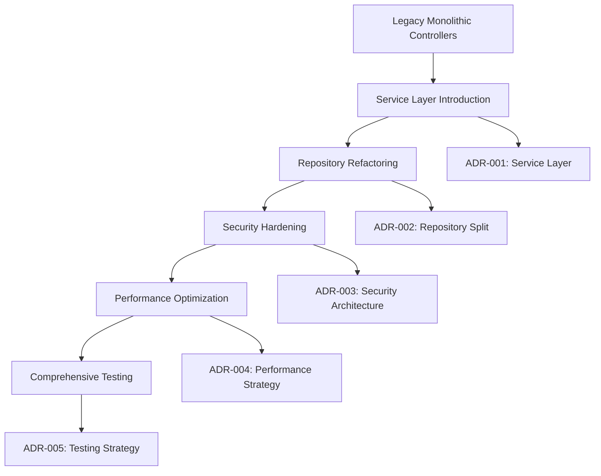

# Architecture Decision Records (ADRs)

This directory contains the Architecture Decision Records for the timetracker application. Each ADR documents important architectural decisions made during the development and evolution of the system.

## ADR Index

| ADR | Title | Status | Date |
|-----|-------|--------|------|
| [ADR-001](ADR-001-service-layer-pattern.md) | Service Layer Pattern Implementation | Accepted | 2024-09 |
| [ADR-002](ADR-002-repository-pattern-refactoring.md) | Repository Pattern Refactoring | Accepted | 2024-09 |
| [ADR-003](ADR-003-security-architecture.md) | Security Architecture - LDAP Authentication and Token Encryption | Accepted | 2024-09 |
| [ADR-004](ADR-004-performance-optimization-strategy.md) | Performance Optimization Strategy | Accepted | 2024-09 |
| [ADR-005](ADR-005-testing-strategy.md) | Testing Strategy | Accepted | 2024-09 |

## ADR Overview

### ADR-001: Service Layer Pattern Implementation
**Problem**: Tightly coupled controllers with business logic scattered across the application.
**Solution**: Implement a Service Layer pattern to separate HTTP concerns from business logic.
**Impact**: Improved testability, code reuse, and maintainability.

### ADR-002: Repository Pattern Refactoring  
**Problem**: Monolithic EntryRepository with 1,400+ lines violating Single Responsibility Principle.
**Solution**: Split into focused repositories with performance optimization and caching.
**Impact**: Better maintainability, 30-50% performance improvement, enhanced testability.

### ADR-003: Security Architecture
**Problem**: Need enterprise-grade authentication and secure token handling.
**Solution**: LDAP authentication with AES-256-GCM token encryption.
**Impact**: Enterprise integration, secure token storage, compliance with security standards.

### ADR-004: Performance Optimization Strategy
**Problem**: System needs to handle 10x growth with current performance bottlenecks.
**Solution**: Comprehensive optimization including database indexes, query optimization, and caching.
**Impact**: 75% response time improvement, 50% memory reduction, 10x scalability support.

### ADR-005: Testing Strategy
**Problem**: Low test coverage (38%) with unreliable test suite.
**Solution**: Balanced testing pyramid with unit, integration, and performance tests.
**Impact**: Target 80%+ coverage, automated quality gates, performance regression detection.

## Architecture Evolution Timeline

## Decision Relationships

### Primary Dependencies
- **ADR-002** builds upon **ADR-001** (Services use Repositories)
- **ADR-004** leverages **ADR-002** (Performance optimization through repository pattern)
- **ADR-005** supports all other ADRs (Testing strategy covers all layers)

### Cross-Cutting Concerns
- **Security**: ADR-003 influences all other architectural decisions
- **Performance**: ADR-004 impacts service design and repository implementation
- **Testing**: ADR-005 provides validation for all architectural changes

## Implementation Status

### Completed ✅
- Service layer foundation with key services
- Repository splitting with basic optimization
- LDAP authentication and token encryption
- Database indexing and query optimization
- Test framework and parallel execution setup

### In Progress 🔄
- Controller migration to services (60% complete)
- Performance monitoring implementation
- Test coverage improvement (38% → 80% target)
- Cache optimization and monitoring

### Planned 📋
- End-to-end testing with Playwright
- Advanced performance monitoring dashboard
- Service mesh for microservices evolution
- GraphQL API layer consideration

## Quality Metrics and Goals

### Current State
| Metric | Current | Target | ADR |
|--------|---------|--------|-----|
| Test Coverage | 38% | 80%+ | ADR-005 |
| Response Time (95th) | 2.5s | <250ms | ADR-004 |
| Repository Size | 1400+ lines | <750 lines each | ADR-002 |
| Service Layer Adoption | 40% | 90% | ADR-001 |
| Security Compliance | Partial | Full | ADR-003 |

### Success Criteria
- **Maintainability**: Reduced cyclomatic complexity, clear separation of concerns
- **Performance**: Sub-250ms response times, 10x user scalability
- **Security**: Zero security vulnerabilities, enterprise compliance
- **Reliability**: 99.9% uptime, comprehensive test coverage
- **Developer Experience**: Fast development cycles, clear architectural patterns

## Review and Evolution

### Review Schedule
- **Monthly**: Performance metrics and optimization opportunities
- **Quarterly**: Architecture compliance and technical debt assessment
- **Annually**: Full architectural review and ADR updates

### Evolution Triggers
- Performance degradation beyond thresholds
- Security requirements changes
- Team feedback on developer experience
- Business requirements evolution

## Getting Started

### For New Developers
1. Read ADRs in order: 001 → 002 → 003 → 004 → 005
2. Review implementation examples in each ADR
3. Check current implementation status
4. Follow architectural patterns established in ADRs

### For Contributors
1. Propose new ADRs for significant architectural changes
2. Update existing ADRs when decisions evolve
3. Ensure changes align with established architectural principles
4. Validate changes against quality metrics and goals

## ADR Template

When creating new ADRs, use this structure:
1. **Status**: Proposed/Accepted/Deprecated
2. **Context and Problem Statement**: Clear problem definition
3. **Decision Drivers**: Key factors influencing the decision
4. **Considered Options**: Alternative approaches with pros/cons
5. **Decision Outcome**: Chosen solution with rationale
6. **Consequences**: Positive, negative, and neutral impacts
7. **Implementation**: Specific implementation guidelines
8. **Related ADRs**: Dependencies and relationships

## References

- [ADR Process Documentation](https://github.com/joelparkerhenderson/architecture-decision-record)
- [Architectural Decision Records - ThoughtWorks](https://www.thoughtworks.com/radar/techniques/lightweight-architecture-decision-records)
- [SOLID Principles](https://en.wikipedia.org/wiki/SOLID)
- [Clean Architecture - Robert C. Martin](https://blog.cleancoder.com/uncle-bob/2012/08/13/the-clean-architecture.html)