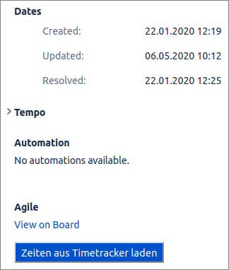
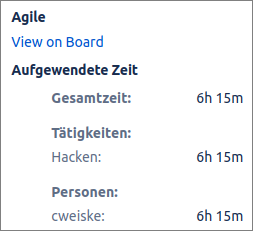

# Application Features

A concise overview of what TimeTracker does. The [User Guide](user-guide.md)
explains each feature in detail, with screenshots.

## Time tracking

- **Worklog grid** ([guide](user-guide.md#worklog--tracking-your-time)):
  spreadsheet-style inline editing (double-click, <kbd>Enter</kbd>/<kbd>F2</kbd>,
  type-to-edit), terse time input (`930` → `09:30`), auto-save of completed rows.
- **Smart assistance:** typing a ticket number derives project and customer
  from the project's configured ticket prefixes; suggested start/end times
  continue from your latest entry.
- **Row actions:** Continue, Prolong-to-now, per-scope Info totals, Delete
  with confirmation.
- **Visual cues:** rows are color-coded for day breaks, unbooked gaps (breaks)
  and time overlaps.
- **Adjustable range:** show 1–366 days of entries; choice is remembered.
- **Bulk entry** ([guide](user-guide.md#bulk-entry-vacation-sickness-)):
  one entry per day over a date range from admin-managed presets (e.g.
  vacation, sick leave), using contract hours or explicit times, with
  skip-weekends/holidays options.

## Reporting & analysis

- **Overview** ([guide](user-guide.md#overview--monthly-calendar-and-balance)):
  monthly calendar comparing worked time against your contract's per-weekday
  target hours — per-day deltas, holidays, free day/week/year selection, and a
  balance summary with progress ring. Deep-linkable; the header's
  Today/Week/Month working-time badges jump straight into it.
- **Evaluation** ([guide](user-guide.md#evaluation--charts-and-analysis)):
  filterable effort breakdowns by customer, project, ticket, activity, user
  and day (with target line), plus a sortable entry list. Date-range presets
  from *Today* to *Last 12 months*.
- **Billing export** ([guide](user-guide.md#billing--monthly-statement-xlsx)):
  monthly-statement XLSX for controlling, filtered by user/project/customer,
  with optional billable-only mode (enabled via
  `APP_SHOW_BILLABLE_FIELD_IN_EXPORT`) and ticket titles. PL/ADMIN only.
- **Personal CSV export:** download your own entries for the shown day range
  from the Worklog toolbar (`/export/{days}`).

## Administration

([guide](user-guide.md#administration)) — PL/ADMIN only. Shared CRUD shell
with search, sorting, show-inactive toggle, CSV export and bulk actions, for:

- **Customers**, **Projects** (ticket system, ticket prefixes, leads, billing
  type, references, estimation, internal-Jira mapping), **Users**, **Teams**
- **Holidays** (non-working days), **Presets** (bulk-entry templates)
- **Ticket systems** (Jira connections, write-only OAuth secrets)
- **Activities** (needs-ticket flag, evaluation factor)
- **Contracts** (per-user validity and target hours per weekday)
- **Status** — read-only diagnostics: versions, build info, database, package
  list and a GitHub update check.

## User roles & permissions

User types defined in [`src/Enum/UserType.php`](../src/Enum/UserType.php):

- **USER / DEV:** track time, bulk entry, Overview, Evaluation, CSV export.
- **PL (Project Lead):** all of the above plus Billing and Administration
  (PL currently carries `ROLE_ADMIN` for v4 compatibility).
- **ADMIN:** all of the above plus Billing and Administration.

Worklog entries are always personal — users only manage their own entries.

## Authentication & security

- **LDAP / Active Directory login** with optional automatic user creation on
  first login (`LDAP_CREATE_USER`); deactivated accounts are refused.
- **Stay signed in** (30-day remember-me), CSRF-protected login and logout.
- **Session-expired overlay:** an expired session re-authenticates in place
  without losing unsaved work.
- Jira OAuth tokens are stored encrypted at rest (`APP_ENCRYPTION_KEY`,
  falling back to `APP_SECRET`).
- Optional **Sentry** error reporting (DSN via environment).

## User experience

- **Bilingual UI** (English/German), per-user language setting.
- **Personal settings** ([guide](user-guide.md#settings)): empty-line,
  suggest-time, show-future and minimum-entry-duration on the account;
  Enter behavior, date format, font (incl. OpenDyslexic), text size and
  navigation layout per device.
- **Theme** (system/light/dark) and **display density** (comfortable /
  compact / ultra-compact) toggles.
- **Keyboard-first:** full shortcut system with in-app cheat sheet
  ([guide](user-guide.md#keyboard-shortcuts)) and a
  <kbd>Ctrl</kbd>/<kbd>⌘</kbd>+<kbd>K</kbd>
  [command palette](user-guide.md#command-palette).
- **In-app Help page** with usage notes, legend and shortcut reference.
- **Configurable branding:** title, logo and an optional header frame via
  `APP_TITLE`, `APP_LOGO_URL`, `APP_HEADER_URL`.

## Jira integration

([guide](user-guide.md#jira-integration))

- **Automatic worklog sync:** entries on projects linked to a Jira ticket
  system with *time booking* enabled are mirrored as Jira worklogs on save,
  edit and delete; ticket changes clean up the old worklog. Sync failures
  never block saving.
- **Per-user OAuth authorization** per ticket system; TimeTracker sends the
  user to Jira's authorize page on first use and stores the token encrypted.
- **Subticket sync** per project or across all projects (admin endpoints and
  the `tt:sync-subtickets` console command).
- **Internal ticket mapping:** book on external ticket numbers and mirror
  worklogs into an internal Jira project.
- **Time display inside Jira:** optional userscript, see
  [below](#jira-cloud-time-display-userscript).

## Jira Cloud Time Display (Userscript)

Tracked times can be shown on Jira Cloud ticket pages even when worklogs are
not synced to that instance, using the bundled userscript
[`public/scripts/timeSummaryForJira.js`](../public/scripts/timeSummaryForJira.js):

1. Install the [Greasemonkey browser extension](https://addons.mozilla.org/de/firefox/addon/greasemonkey/)
   (or a compatible userscript manager).
2. Import `public/scripts/timeSummaryForJira.js` and adjust the `timetracker`
   hostname in the script to your installation's URL.
3. Open a ticket detail page on a `*.atlassian.net` Jira Cloud instance. The
   sidebar shows a "Zeiten aus Timetracker laden" button; clicking it fetches
   the time summary from the TimeTracker API
   (`/getTicketTimeSummary/<ticket>`) and displays it.

## API & operations

- **HTTP API** used by the SPA, documented as an OpenAPI v3 spec
  ([`public/api.yml`](../public/api.yml)) with a Swagger UI under
  `/docs/swagger/` (behind login). Authentication is session-based.
- **Health endpoints:** `GET /status/check` and `GET /status/page` (public).
- Console commands: `tt:encrypt-jira-tokens`, `tt:sync-subtickets`
  (see [`src/Command/`](../src/Command)).
