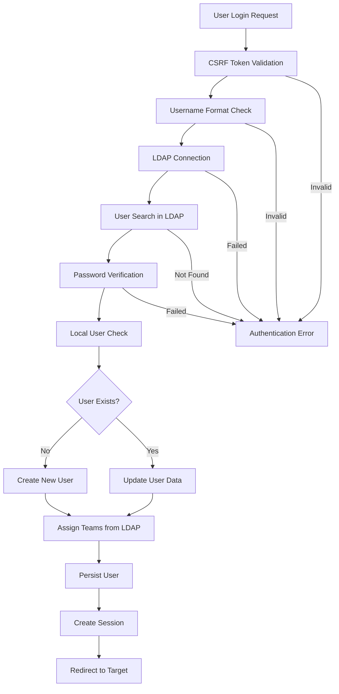
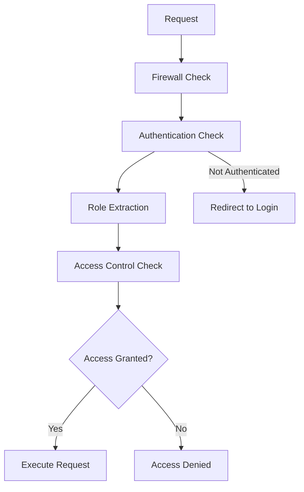
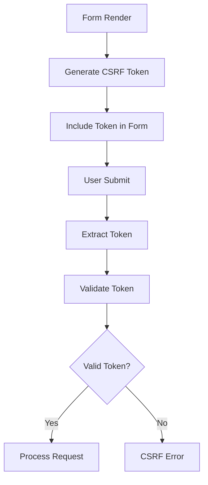

# TimeTracker Security Documentation

## Table of Contents
1. [Security Architecture Overview](#security-architecture-overview)
2. [Authentication System](#authentication-system)
3. [Authorization Model](#authorization-model)
4. [CSRF Protection](#csrf-protection)
5. [Security Components](#security-components)
6. [Configuration Analysis](#configuration-analysis)
7. [Security Best Practices](#security-best-practices)
8. [Flow Diagrams](#flow-diagrams)

## Security Architecture Overview

TimeTracker implements a comprehensive security architecture built on Symfony Security components with the following key features:

- **LDAP-based Authentication**: Users authenticate against an external LDAP server
- **Role-based Authorization**: Roles derived from user types (`USER`/`DEV`/`PL`/`ADMIN`, see [`src/Enum/UserType.php`](../src/Enum/UserType.php))
- **Stateless CSRF Protection**: Token-based protection for forms and sensitive operations
- **Encrypted Token Storage**: AES-256-GCM encryption for sensitive tokens
- **Session Management**: Secure session handling with remember-me functionality
- **Input Sanitization**: LDAP injection prevention and username validation

### Security Layers

```
┌─────────────────────────────────────────┐
│           Web Layer                     │
├─────────────────────────────────────────┤
│         CSRF Protection                 │
├─────────────────────────────────────────┤
│       Firewall Security                 │
├─────────────────────────────────────────┤
│     LDAP Authentication                 │
├─────────────────────────────────────────┤
│      Role Authorization                 │
├─────────────────────────────────────────┤
│       Entity Security                   │
├─────────────────────────────────────────┤
│       Data Layer                       │
└─────────────────────────────────────────┘
```

## Authentication System

### LDAP Integration

The authentication system is built around LDAP integration using the `LdapAuthenticator` class:

**Key Features:**
- External LDAP server authentication
- Automatic user creation on first login (configurable)
- Team assignment from LDAP organizational units
- Secure credential handling
- Comprehensive error logging

**Authentication Flow:**
```
1. User submits login form with credentials
2. CSRF token validation
3. Username format validation
4. LDAP connection establishment
5. User search in LDAP directory
6. Password verification via LDAP bind
7. Local user creation/retrieval
8. Team assignment from LDAP OU mapping
9. Session establishment
10. Redirect to target path
```

### LDAP Configuration

LDAP settings are managed via environment variables:

```yaml
# Example LDAP configuration
ldap_host: "ldap.example.com"
ldap_port: 389
ldap_usessl: true
ldap_readuser: "cn=readonly,dc=example,dc=com"
ldap_readpass: "password"
ldap_basedn: "ou=users,dc=example,dc=com"
ldap_usernamefield: "sAMAccountName"
ldap_create_user: true
```

### User Creation Process

When `ldap_create_user` is enabled:

1. **LDAP Authentication**: Verify credentials against LDAP
2. **Local User Creation**: Create User entity with default settings
3. **Team Assignment**: Map LDAP OUs to local teams via YAML configuration
4. **Database Persistence**: Save new user to database

**Default User Settings:**
- Type: `DEV` (Developer role)
- Locale: `de` (German)
- Teams: Mapped from LDAP OU structure

### Team Mapping

Team assignment uses an **optional** YAML file, `config/ldap_ou_team_mapping.yml`.
It is **not shipped with the repository** — [`src/Service/Ldap/LdapClientService.php`](../src/Service/Ldap/LdapClientService.php)
probes for it at runtime and, when absent, logs a warning and skips team
assignment. To enable OU→team mapping, create the file yourself:

```yaml
# config/ldap_ou_team_mapping.yml (maps LDAP OU names to TimeTracker team names)
development: "Development Team"
qa: "Quality Assurance"
management: "Management"
```

## Authorization Model

### User Types and Roles

TimeTracker uses a user type system defined in
[`src/Enum/UserType.php`](../src/Enum/UserType.php):

| User Type | Symfony Roles | Description |
|-----------|---------------|-------------|
| `UNKNOWN` (empty string) | `ROLE_USER` | Unconfigured legacy value |
| `USER` | `ROLE_USER` | Basic user |
| `DEV` | `ROLE_USER` | Developer (default for LDAP-created users) |
| `PL` | `ROLE_USER`, `ROLE_PL`, **`ROLE_ADMIN`** | Project Lead — currently also carries `ROLE_ADMIN` for TimeTracker v4 compatibility (see the TODO in the enum), so PL users have **full admin access** including `^/admin` |
| `ADMIN` | `ROLE_USER`, `ROLE_ADMIN` | Administrator, full system access |

> **Security note:** `^/admin` routes are gated by `ROLE_ADMIN`, which both
> `ADMIN` **and `PL`** satisfy. Treat the PL type as an administrative role
> until the v4-compatibility grant is removed.

### Role Hierarchy

The security configuration defines role inheritance:

```yaml
role_hierarchy:
    ROLE_ADMIN: ROLE_USER
    ROLE_SUPER_ADMIN: [ROLE_USER, ROLE_ADMIN, ROLE_ALLOWED_TO_SWITCH]
```

### Access Control Rules

Path-based access control is configured in `security.yaml`:

```yaml
access_control:
    - { path: ^/login, roles: PUBLIC_ACCESS }
    - { path: ^/login_check, roles: PUBLIC_ACCESS }
    - { path: ^/css, roles: PUBLIC_ACCESS }
    - { path: ^/js, roles: PUBLIC_ACCESS }
    - { path: ^/images, roles: PUBLIC_ACCESS }
    - { path: ^/status/check, roles: PUBLIC_ACCESS }
    - { path: ^/status/page, roles: PUBLIC_ACCESS }
    - { path: ^/admin, roles: ROLE_ADMIN }
    - { path: ^/, roles: IS_AUTHENTICATED_FULLY }
```

### User Switching (Impersonation)

The firewall configures user switching via the `simulateUserId` parameter:

```yaml
switch_user:
    parameter: simulateUserId
    role: ROLE_ALLOWED_TO_SWITCH
```

`ROLE_ALLOWED_TO_SWITCH` is only granted through `ROLE_SUPER_ADMIN` in the role
hierarchy, and no user type currently maps to `ROLE_SUPER_ADMIN`
([`src/Enum/UserType.php`](../src/Enum/UserType.php) grants at most
`ROLE_ADMIN`) — so impersonation is configured but effectively unavailable.

## CSRF Protection

### Stateless CSRF Implementation

TimeTracker uses Symfony's stateless CSRF tokens for the login and logout
flows. Configured in [`config/packages/framework.yaml`](../config/packages/framework.yaml):

```yaml
framework:
    csrf_protection:
        enabled: true
        stateless_token_ids: ['authenticate', 'logout']
```

**Key Features:**
- The `authenticate` and `logout` token IDs are validated **statelessly** — no
  server-side session storage; validation relies on the `Sec-Fetch-Site` /
  `Origin` / `Referer` headers of a same-origin navigation
- Login form CSRF enabled via `form_login.enable_csrf: true`
- Logout CSRF enabled via `logout.enable_csrf: true`, blocking cross-site
  forced logout ([commit 441ce91d](https://github.com/netresearch/timetracker/commit/441ce91d))

### CSRF Token Usage

**Login Form Integration** ([`templates/login.html.twig`](../templates/login.html.twig)):
```twig
<input type="hidden" name="_csrf_token" value="{{ csrf_token('authenticate') }}">
```

**Logout Protection** ([`config/packages/security.yaml`](../config/packages/security.yaml)):
```yaml
logout:
    path: _logout
    target: _login
    invalidate_session: true
    enable_csrf: true  # validates the _csrf_token appended by logout_path()
```

## Security Components

### 1. LdapAuthenticator

**Location:** `src/Security/LdapAuthenticator.php`

**Responsibilities:**
- LDAP authentication handling
- User creation and management
- CSRF token validation
- Session management
- Security logging

**Security Features:**
- LDAP injection prevention via input sanitization
- Username format validation (alphanumeric + special chars)
- Secure error handling (no information leakage)
- Comprehensive audit logging

**Input Sanitization:**
```php
private function sanitizeLdapInput(string $input): string
{
    $metaChars = [
        '\\' => '\5c',   // Must be first
        '*' => '\2a',
        '(' => '\28',
        ')' => '\29',
        "\x00" => '\00',
        '/' => '\2f',
    ];

    return str_replace(
        array_keys($metaChars),
        array_values($metaChars),
        $input,
    );
}
```

### 2. TokenEncryptionService

**Location:** `src/Service/Security/TokenEncryptionService.php`

**Responsibilities:**
- Secure token encryption/decryption (`encryptToken()` / `decryptToken()` / `rotateToken()`)
- Key derivation

**Security Features:**
- AES-256-GCM authenticated encryption
- Random IV generation for each encryption; ciphertext stored as
  `base64(iv + tag + ciphertext)`
- Key derived via SHA-256 from `APP_ENCRYPTION_KEY` (falls back to
  `APP_SECRET`, see `app.encryption_key` in [`config/services.yaml`](../config/services.yaml))
- Token rotation capability (`rotateToken()`)

**What is encrypted:** the per-user Jira OAuth credentials (`accesstoken`,
`tokensecret` columns of the `users_ticket_systems` table,
[`src/Entity/UserTicketsystem.php`](../src/Entity/UserTicketsystem.php)).
They are encrypted before persisting by
[`src/Service/Integration/Jira/JiraAuthenticationService.php`](../src/Service/Integration/Jira/JiraAuthenticationService.php)
and decrypted on use. Databases predating encryption are migrated with the
idempotent console command `bin/console tt:encrypt-jira-tokens`
([`src/Command/EncryptJiraTokensCommand.php`](../src/Command/EncryptJiraTokensCommand.php)).

> Changing `APP_ENCRYPTION_KEY` (or `APP_SECRET` while relying on the fallback)
> makes existing tokens undecryptable — affected users must re-authorize
> against Jira.

### 3. SecurityController

**Location:** `src/Controller/SecurityController.php`

**Responsibilities:**
- Login form rendering
- Logout handling
- Authentication error display

**Security Features:**
- Secure session invalidation
- Error message sanitization
- Template security context

### 4. LdapClientService

**Location:** `src/Service/Ldap/LdapClientService.php`

**Responsibilities:**
- LDAP connection management
- User verification
- Team mapping
- Secure credential handling

**Security Features:**
- SSL/TLS support for LDAP connections
- Secure credential storage
- LDAP injection prevention
- DN construction security
- Comprehensive error handling

## Configuration Analysis

### Main Security Configuration

**File:** [`config/packages/security.yaml`](../config/packages/security.yaml) (abridged)

```yaml
security:
    password_hashers:
        App\Entity\User: 'auto'

    providers:
        app_user_provider:
            entity:
                class: App\Entity\User
                property: username

    role_hierarchy:
        ROLE_ADMIN: ROLE_USER
        ROLE_SUPER_ADMIN: [ROLE_USER, ROLE_ADMIN, ROLE_ALLOWED_TO_SWITCH]

    firewalls:
        dev:
            pattern: ^/(_(profiler|wdt)|css|images|js)/
            security: false

        main:
            provider: app_user_provider
            # Refuse login for deactivated accounts (users.active = 0)
            user_checker: App\Security\UserChecker
            lazy: true
            entry_point: form_login

            custom_authenticators:
                - App\Security\LdapAuthenticator

            form_login:
                login_path: _login
                check_path: _login
                enable_csrf: true

            logout:
                path: _logout
                target: _login
                invalidate_session: true
                enable_csrf: true

            remember_me:
                secret: '%kernel.secret%'
                lifetime: 2592000  # 30 days
                path: /
                secure: auto  # Secure over HTTPS, non-secure over HTTP

            switch_user:
                parameter: simulateUserId
                role: ROLE_ALLOWED_TO_SWITCH
```

### Test Environment Configuration

**File:** `config/packages/test/security.yaml`

The test environment uses simplified authentication:
- Form login instead of LDAP authenticator
- Remember-me functionality disabled
- Simplified firewall configuration

### Environment Variables

**Required Security Environment Variables:**
```env
# LDAP Configuration
LDAP_HOST=ldap.example.com
LDAP_PORT=389
LDAP_USESSL=true
LDAP_READUSER=cn=readonly,dc=example,dc=com
LDAP_READPASS=password
LDAP_BASEDN=ou=users,dc=example,dc=com
LDAP_USERNAMEFIELD=sAMAccountName
LDAP_CREATE_USER=true

# Encryption
APP_SECRET=your-secret-key
# Optional dedicated key for Jira token encryption; falls back to APP_SECRET
APP_ENCRYPTION_KEY=your-encryption-key

# Symfony Configuration
APP_ENV=prod
```

## Security Best Practices

### 1. Input Validation and Sanitization

**LDAP Injection Prevention:**
- All LDAP inputs are sanitized using RFC 4515 escaping
- Username format validation (alphanumeric + specific special characters)
- Maximum username length enforcement (256 characters)

**Validation Rules:**
```php
private function isValidUsername(string $username): bool
{
    if (strlen($username) > 256) {
        return false;
    }

    return 1 === preg_match('/^[a-zA-Z0-9._@-]+$/', $username);
}
```

### 2. Secure Session Management

**Session Security Features:**
- Automatic session invalidation on logout
- Session ID regeneration on authentication
- Secure cookie configuration (`cookie_secure: auto`, `cookie_samesite: lax` in
  [`config/packages/framework.yaml`](../config/packages/framework.yaml))
- Remember-me cookies are marked `Secure` automatically when served over HTTPS
  (`secure: auto`)

### 3. Password Security

**LDAP Password Handling:**
- Passwords never stored locally
- LDAP bind for verification
- Secure password transmission
- No password caching

**Remember-Me Security:**
```php
public function getPassword(): ?string
{
    // Generate stable hash for remember_me functionality
    return hash('sha256', $this->username . '_ldap_user_' . ($this->id ?? '0'));
}
```

### 4. Error Handling

**Security-Conscious Error Messages:**
- Generic error messages to prevent information leakage
- Detailed logging for security events
- No sensitive data in user-facing errors

```php
catch (\Laminas\Ldap\Exception\LdapException $ldapException) {
    $this->logger->error('LDAP authentication error', [
        'username' => substr($userIdentifier, 0, 3) . '***',
        'error_code' => $ldapException->getCode(),
    ]);

    throw new CustomUserMessageAuthenticationException(
        'Authentication failed. Please check your credentials.'
    );
}
```

### 5. Cryptographic Security

**Token Encryption:**
- AES-256-GCM authenticated encryption
- Random IV for each encryption operation
- Secure key derivation
- Authenticated decryption with integrity verification

### 6. Access Control

**Defense in Depth:**
- Path-based access control
- Role-based authorization
- Entity-level security checks
- CSRF protection on sensitive operations

## Flow Diagrams

### Authentication Flow



### Authorization Flow



### CSRF Protection Flow



## Security Considerations

### Current Security Strengths

1. **Strong Authentication**: LDAP integration with proper credential verification
2. **Comprehensive Input Validation**: LDAP injection prevention and format validation
3. **Modern Encryption**: AES-256-GCM for token encryption
4. **Stateless CSRF**: No server-side session dependency
5. **Secure Session Management**: Proper invalidation and regeneration
6. **Audit Logging**: Comprehensive security event logging
7. **Role-based Access Control**: Hierarchical permission system

### Potential Security Enhancements

1. **Rate Limiting**: Implement login attempt rate limiting
2. **Password Complexity**: Enforce LDAP password policies
3. **Multi-Factor Authentication**: Add 2FA support
4. **Security Headers**: Implement additional HTTP security headers
5. **Content Security Policy**: Add CSP for XSS prevention
6. **API Security**: Implement OAuth2 or JWT for API access
7. **Audit Trail**: Enhanced user action auditing

### Compliance Considerations

- **GDPR**: Ensure proper data handling and user consent
- **Access Logging**: Maintain comprehensive access logs
- **Data Encryption**: All sensitive data encrypted at rest and in transit
- **Regular Security Reviews**: Periodic security assessments

This documentation provides a comprehensive overview of TimeTracker's security architecture and should be regularly updated as security components evolve.