# User Guide

TimeTracker is a web application for logging work time against customers,
projects and activities, with optional Jira worklog synchronization. This
guide covers everything you see and do in the app as an end user. For a short
feature list see [features.md](features.md); for quick answers see the
[FAQ](FAQ.md).

The UI is fully available in **English and German** — switch under
[Settings](#settings).

## Contents

- [Signing in](#signing-in)
- [The application at a glance](#the-application-at-a-glance)
- [User roles](#user-roles)
- [Worklog — tracking your time](#worklog--tracking-your-time)
- [Bulk entry (vacation, sickness, …)](#bulk-entry-vacation-sickness-)
- [Overview — monthly calendar and balance](#overview--monthly-calendar-and-balance)
- [Evaluation — charts and analysis](#evaluation--charts-and-analysis)
- [Billing — monthly statement (XLSX)](#billing--monthly-statement-xlsx)
- [Administration](#administration)
- [Settings](#settings)
- [Theme, density and layout](#theme-density-and-layout)
- [Keyboard shortcuts](#keyboard-shortcuts)
- [Command palette](#command-palette)
- [Jira integration](#jira-integration)
- [Help](#help)

## Signing in

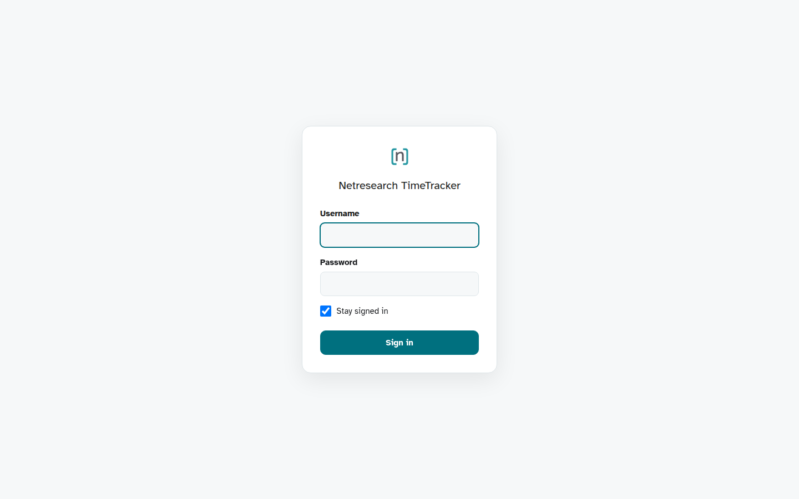

Sign in with your **organization (LDAP / Active Directory) username and
password**. There is no separate registration: if your instance has automatic
user creation enabled, your TimeTracker account is created on your first
successful login; otherwise an administrator must create it first.

- **Stay signed in** keeps you logged in for 30 days on that browser.
- Deactivated accounts are refused at login — contact an administrator if you
  believe yours was deactivated by mistake.
- After a failed attempt your username stays pre-filled; only the password
  needs re-typing.

**Session expiry:** if your session expires while the app is open, the page
dims and an in-place *"Session expired"* dialog asks you to sign in again.
Your unsaved work on the page is kept — after re-login the app simply
continues where you were.

**Logging out:** use the logout icon at the far right of the header (or in the
mobile menu).

## The application at a glance

The navigation (top bar by default, switchable to a sidebar in
[Settings](#settings)) contains:

| Item | Who sees it | What it is |
|---|---|---|
| **Worklog** | everyone | The time-entry grid — your day-to-day workspace |
| **Overview** | everyone | Monthly calendar with worked vs. contract time |
| **Evaluation** | everyone | Filterable effort charts and entry lists |
| **Billing** | PL, ADMIN | Monthly-statement XLSX export |
| **Administration** | PL, ADMIN | Customers, projects, users, teams, … |
| ⚙ Settings / ? Help | everyone | Open as dialogs over the current page |

The header also shows three **working-time badges** — *Today*, *Week*,
*Month* — comparing your booked time against your contract target. They update
automatically after every save, edit or delete, and clicking one jumps to the
Overview pre-scoped to that period.

## User roles

Every account has a *user type* (set by an administrator under Administration
→ Users):

| Type | Description | Access |
|---|---|---|
| **USER** / **DEV** | Regular user / developer | Worklog, Overview, Evaluation, bulk entry, own CSV export, Settings |
| **PL** | Project lead | Everything above **plus** Billing and Administration |
| **ADMIN** | Administrator | Everything above **plus** Billing and Administration |

> Note: PL currently carries full administrative rights (a compatibility
> carry-over from TimeTracker v4), so PL and ADMIN unlock the same pages
> (see [`src/Enum/UserType.php`](../src/Enum/UserType.php)).

Regardless of role, worklog entries are personal: you can only create, edit
and delete **your own** entries.

## Worklog — tracking your time

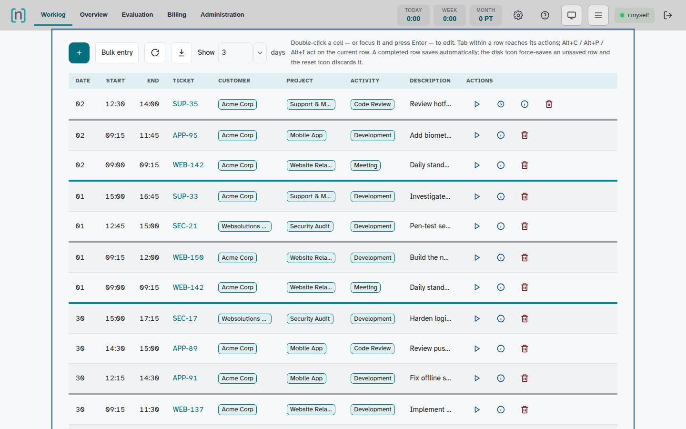

The Worklog is a spreadsheet-like grid. Each row is one block of time with
**date, start, end, ticket, customer, project, activity** and **description**.
Rows are grouped per day, newest first.

### Adding and editing entries

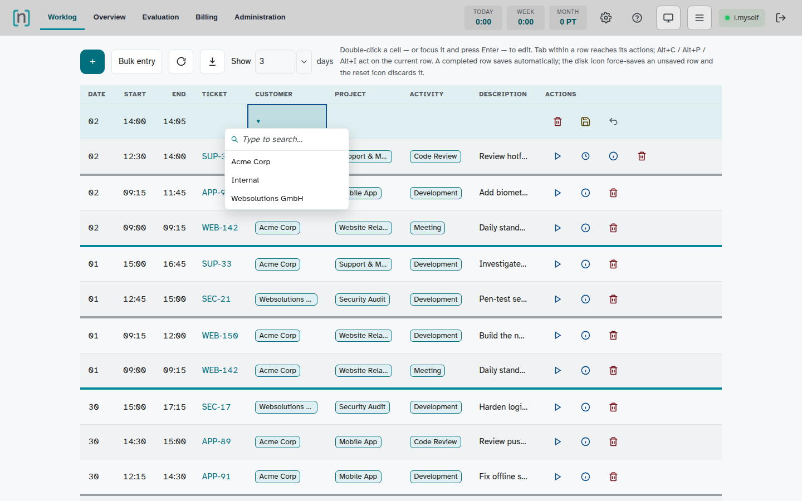

- **Add** an entry with the **+** button or <kbd>Alt</kbd>+<kbd>A</kbd>.
- **Edit** any cell in place: double-click it, or focus it with the arrow keys
  and press <kbd>Enter</kbd> / <kbd>F2</kbd> — or simply start typing.
  Dropdown cells (customer, project, activity) offer type-to-search.
- **Times can be typed tersely**: `930` becomes `09:30`, `9` becomes `09:00`;
  `9.30`, `9h30`, `9:30am` and similar forms work too.
- A row **saves automatically** once its date, times, customer, project and
  activity are valid. While a row has unsaved edits, a **disk icon** appears
  to force-save it and a **reset icon** discards the changes (a never-saved
  new row is removed).
- **Delete** a row with its trash icon — a confirmation dialog guards against
  accidents.

### Smart assistance while typing

- **Ticket → project → customer:** type a ticket number (e.g. `WEB-142`) and
  the matching project and its customer are filled in automatically, based on
  the ticket prefixes configured on each project.
- **Customer ↔ project consistency:** changing the customer clears a project
  that doesn't belong to it; picking a project sets its customer.
- **Suggested times:** with *Suggest time* enabled (Settings), a new entry's
  start continues from your latest end time of the day, and its end pre-fills
  start + your *minimum entry duration*.
- Inactive customers/projects are hidden from the pickers; existing entries
  keep their values.

### Row actions

Each row has action icons (also reachable with <kbd>Tab</kbd> inside the row):

| Action | Shortcut | Effect |
|---|---|---|
| **Continue** | <kbd>Alt</kbd>+<kbd>C</kbd> | Start a new entry with the same customer, project, activity and ticket |
| **Prolong** | <kbd>Alt</kbd>+<kbd>P</kbd> | Set the **latest** entry's end time to now |
| **Info** | <kbd>Alt</kbd>+<kbd>I</kbd> | Show booked-time totals for this entry's customer, project, activity and ticket (own vs. total, plus the project estimate) |
| **Delete** | — | Remove the entry (with confirmation) |

### Row colors

Rows are color-coded by how they relate to the entry above them (the legend is
also on the in-app Help page):

- **Day break** — the first entry of a day; marks the start of a new working day.
- **Break** — starts after the previous entry ended, so there is an unbooked gap.
- **Time overlap** — starts before the previous entry ended; the two ranges overlap.

### Toolbar

- **Bulk entry** — see [below](#bulk-entry-vacation-sickness-).
- **Refresh** (<kbd>Alt</kbd>+<kbd>R</kbd>) reloads the entries and the header
  working-time badges.
- **Export CSV** (<kbd>Alt</kbd>+<kbd>X</kbd> or the download icon) downloads
  your entries for the currently shown day range as a CSV file.
- **Show N days** controls how far back the grid reaches: pick a preset
  (1, 3, 7 or 35 days) or type any number of days up to 366. Your choice is
  remembered on this device.

Ticket numbers in the grid link directly to the ticket in the configured
ticket system.

## Bulk entry (vacation, sickness, …)

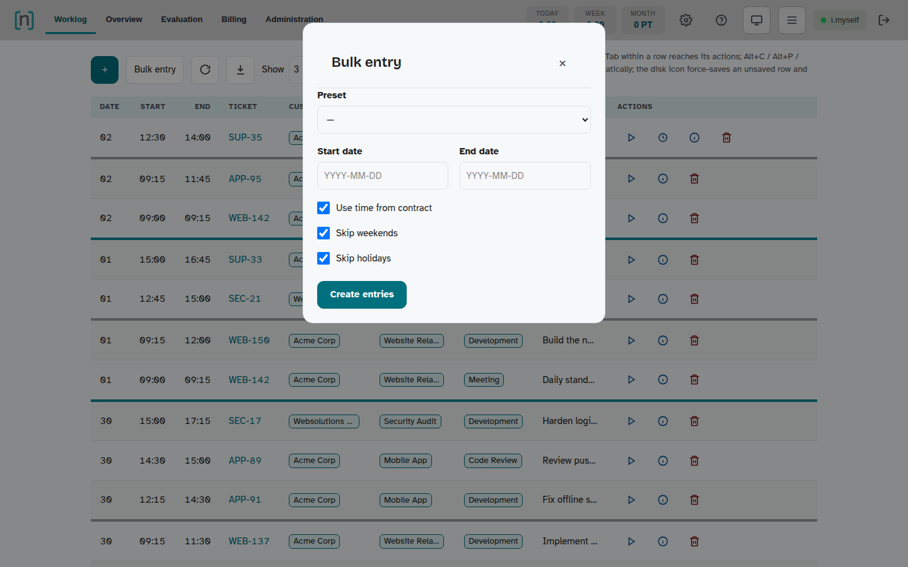

**Bulk entry** (button in the Worklog toolbar, available to every user)
creates one entry per day over a date range from a **preset** — presets such
as "Vacation" or "Sick leave" bundle a customer, project, activity and
description and are maintained by administrators.

1. Choose a preset and the start/end date.
2. Either keep **Use time from contract** (each day gets your contractual
   hours for that weekday) or disable it and enter explicit start/end times.
3. **Skip weekends** and **Skip holidays** exclude those days (both on by
   default).
4. **Create entries** writes the whole range at once.

## Overview — monthly calendar and balance

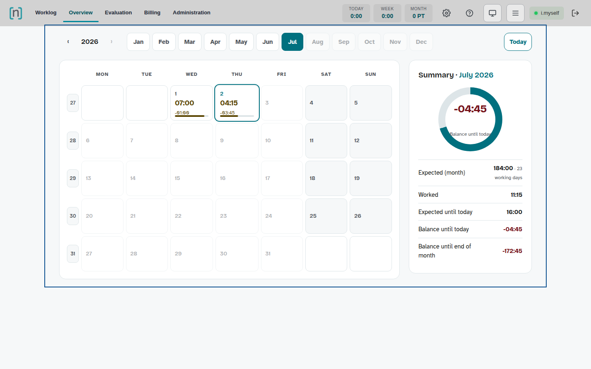

The Overview shows a monthly calendar (Monday–Sunday weeks with ISO week
numbers). Each past working day shows the time you worked, the difference to
your contract target for that weekday, and a small progress bar. Weekends and
public holidays count as non-working days; holidays are labelled by name.

The **summary panel** shows for the current scope:

- **Expected** time (with the number of working days),
- **Worked** time,
- **Expected / balance until today** and the projected **balance until end of
  month**, plus a progress ring of worked vs. expected-until-today.

Navigate with the **month chips** and year arrows; **Today** returns to the
current month. Click the **year** button to aggregate all twelve months.
Click **individual days** (or a week's number for the whole week) to build a
custom selection — the summary then covers exactly those days. The selection
and scope are part of the URL, so views can be bookmarked and shared, and the
header's Today/Week/Month badges deep-link here pre-scoped.

The expected times come from your **work contract** (hours per weekday,
maintained by an administrator under Administration → Contracts). Without a
valid contract the expected time is 0 — ask an administrator to add one if
your targets look wrong.

## Evaluation — charts and analysis

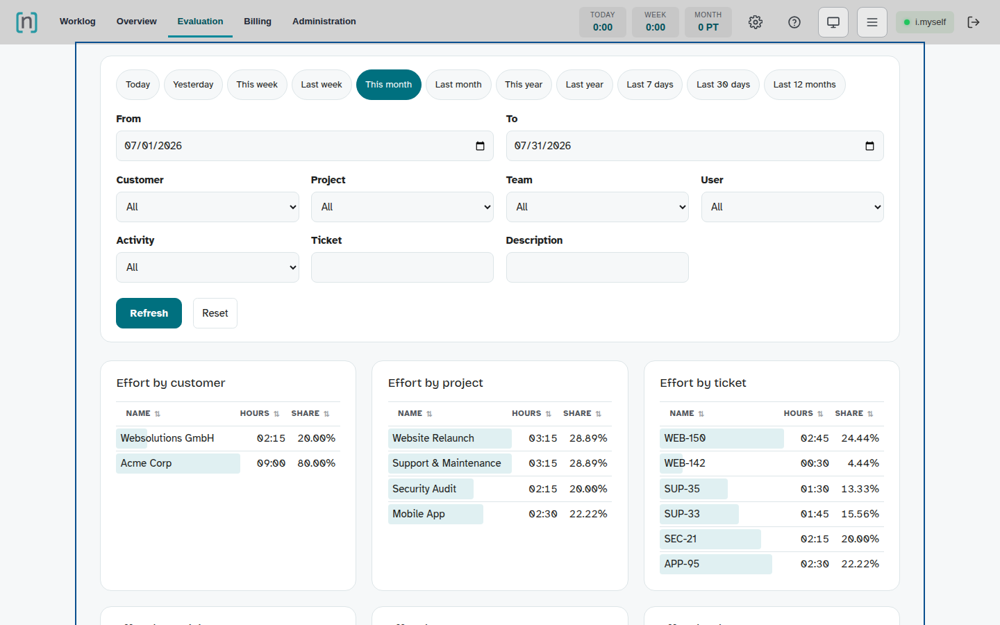

The Evaluation page analyses booked time. The filter bar offers:

- **Quick date ranges** (Today, Yesterday, This/Last week, This/Last month,
  This/Last year, Last 7/30 days, Last 12 months) plus free **From/To** dates,
- **Customer, Project, Team, User, Activity** dropdowns,
- **Ticket** and **Description** text filters.

At least one criterion besides the date range (customer, project, team, user,
activity, ticket or description) is required before results load. **Refresh**
applies the filters; **Reset** returns to the defaults (current month,
yourself).

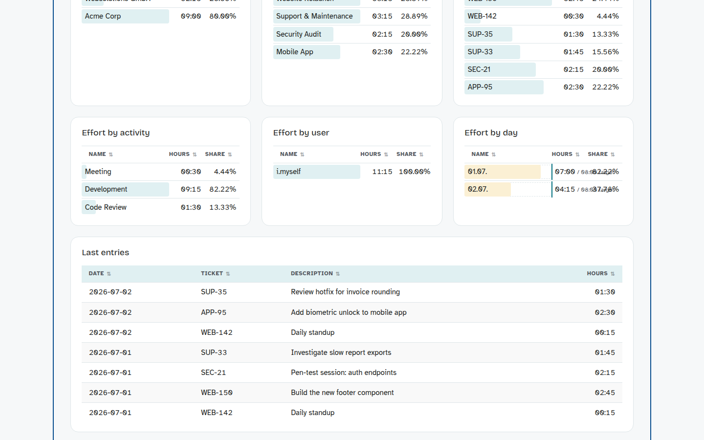

Results are grouped into effort breakdowns **by customer, project, ticket,
activity, user and day** — each a sortable table with hours and percentage
share; the by-day view also shows your expected (target) time. Below them,
**Last entries** lists the matching entries (date, ticket, description,
hours), sortable by clicking a column header (ascending → descending → off).

## Billing — monthly statement (XLSX)

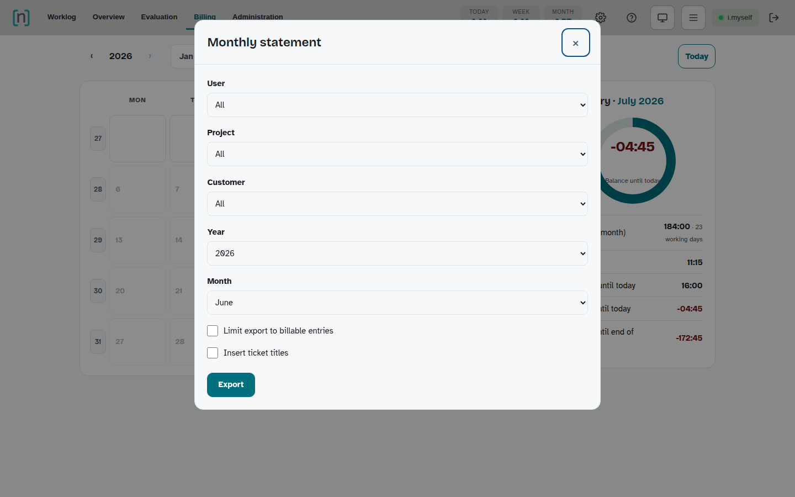

*Visible to PL and ADMIN users only.*

The Billing page (titled *Monthly statement*) exports booked times as an XLSX
workbook for controlling/invoicing:

1. Filter by **user**, **project** and **customer** (or *All* for each).
2. Pick **year** (the last five are offered) and **month** — the previous
   month is preselected.
3. Optionally **limit the export to billable entries** (only offered when the
   instance enables the billable field via `APP_SHOW_BILLABLE_FIELD_IN_EXPORT`)
   and/or **insert ticket titles** fetched from the ticket system.
4. **Export** downloads the file.

The workbook is based on a template and includes a per-user statistics sheet
(holidays, sickness).

## Administration

*Visible to PL and ADMIN users only.*

Administration bundles the master-data panels. All panels share one shell:
a **search filter**, sortable columns, **Add**/**Edit** dialogs, **Delete**,
a **Show inactive** toggle, pagination, **CSV export** of the (filtered) list,
and **bulk actions** (activate / deactivate / delete selected rows).
In the sidebar layout each panel also gets a quick-add "+" button.

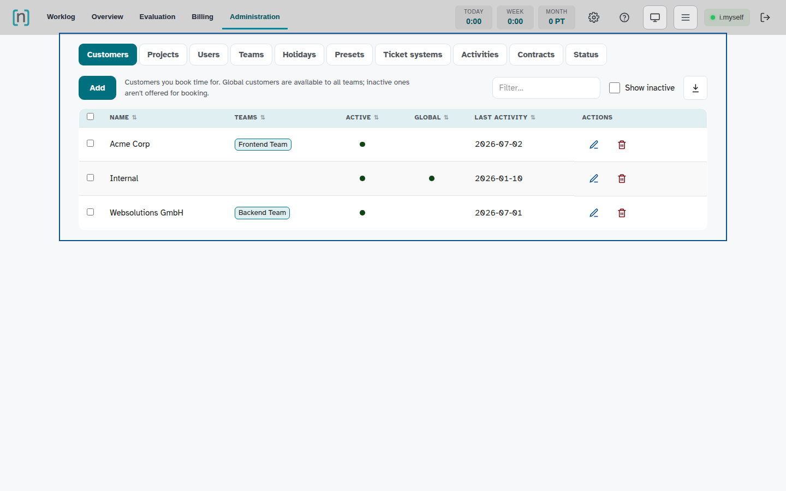

| Panel | Manages |
|---|---|
| **Customers** | Customer records: name, active flag, *global* flag (available to all teams) and team assignment |
| **Projects** | Projects per customer: ticket system, ticket prefix(es), project/technical lead, billing type (time & material / fixed price / none), offer / cost-center / invoice references, estimated duration, subticket list, optional internal-Jira mapping |
| **Users** | Accounts: username, abbreviation, language, user type, teams. Inactive users cannot log in; their entries are kept |
| **Teams** | Team names and team leads; teams group users and customers |
| **Holidays** | Public holidays (date + name) counted as non-working days; add and delete only |
| **Presets** | Templates for bulk entry: name + customer + project + activity + description |
| **Ticket systems** | Ticket-system connections (Jira), see [Jira integration](#jira-integration): URLs, *time booking* flag, OAuth credentials (write-only — leave blank to keep the stored value) |
| **Activities** | Activity types with a *needs ticket* flag and a factor that weights durations in evaluations |
| **Contracts** | Per-user work contracts: validity period and target hours for each weekday (drive the Overview targets and contract-based bulk entry) |
| **Status** | Read-only diagnostics: app/PHP/Symfony versions, build info, database platform, package versions, and an update check against GitHub |

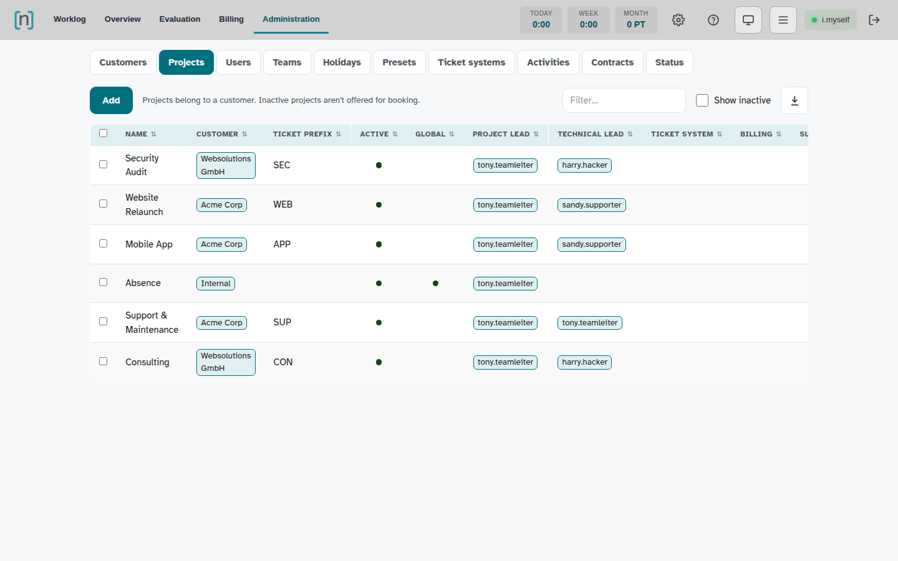

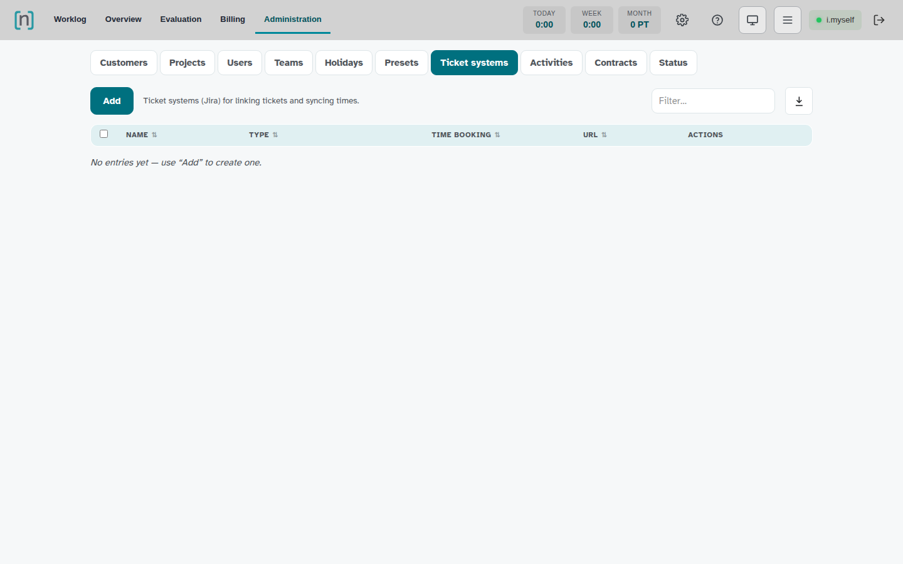

## Settings

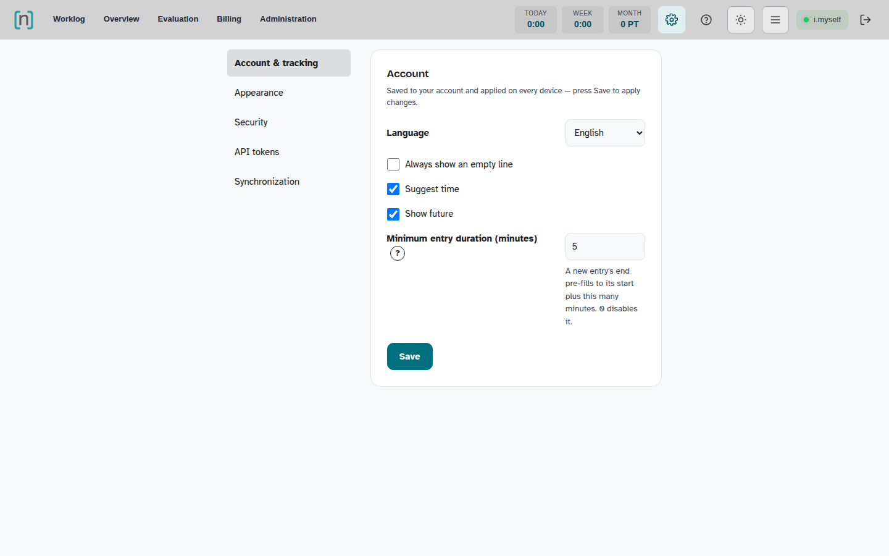

The ⚙ icon opens your personal settings, grouped into two labeled sections
with different save semantics:

**Account** — saved to your account and applied on every device; press *Save*:

- **Language** — English or German (reloads the page).
- **Always show an empty line** — keep a blank entry row ready in the Worklog.
- **Suggest time** — pre-fill new entries' start/end times.
- **Show future** — include future-dated entries in the Worklog.
- **Minimum entry duration (minutes)** — a new entry's end pre-fills to start
  + this many minutes (0 disables it).

**This device** — stored only in this browser; changes apply instantly, no
*Save* needed:

- **When editing a table cell, Enter…** stays / moves down / moves right.
- **Date format** — ISO 8601 (default), automatic by language, or a custom
  pattern (`DD.MM.YYYY`-style tokens) with a live preview. Display only —
  editing always uses ISO.
- **Font** — Hyperlegible (default), system font, or OpenDyslexic; plus
  **text size** (normal / large / larger).
- **Navigation layout** — top bar, left sidebar, or right sidebar.

## Theme, density and layout

Header buttons (explained on the in-app Help page too):

- **Theme** cycles System → Light → Dark.

  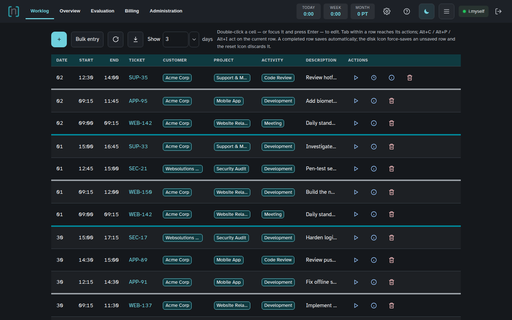

- **Density** cycles Comfortable → Compact → Ultra-compact (ultra-compact
  also hides hint texts and the Worklog legend). Compact fits noticeably more
  rows and columns on screen:

  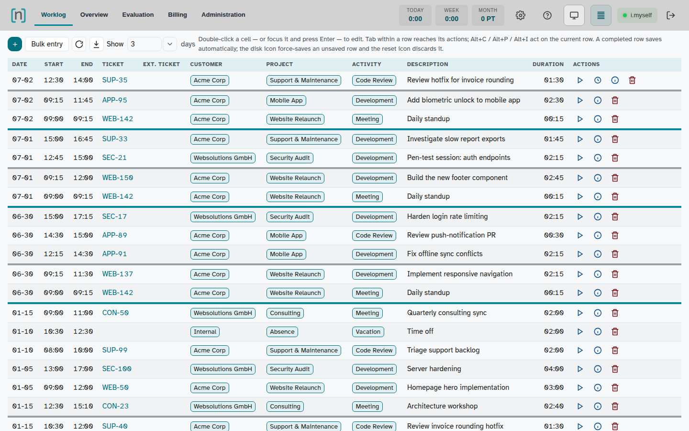

- **Navigation layout** (set in [Settings](#settings)) moves the menu from the
  top bar into a **left or right sidebar**; the sidebar can be collapsed to an
  icon rail and resized by dragging.

  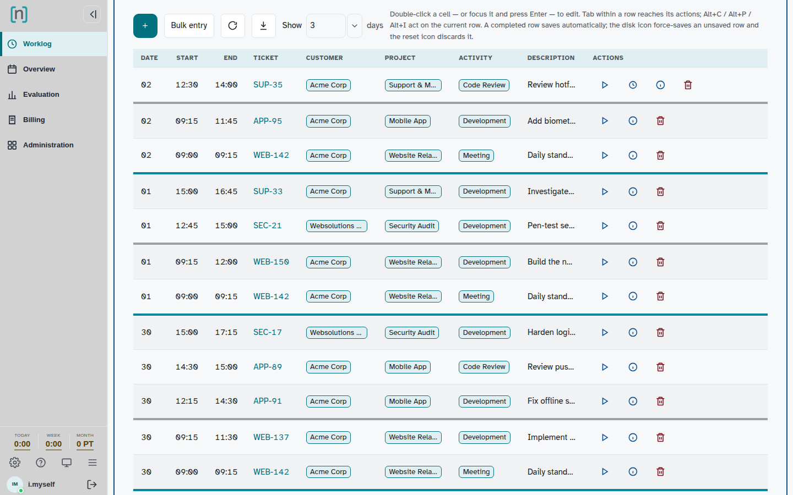

  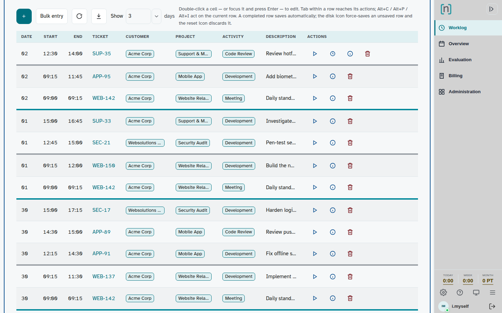

All of these are remembered per device.

## Keyboard shortcuts

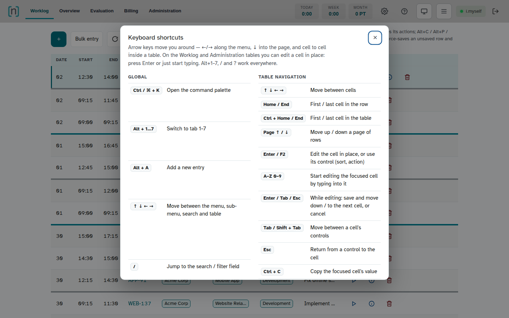

Press <kbd>?</kbd> anywhere for the cheat sheet; the full tables are on the
Help page. Holding <kbd>Alt</kbd> reveals shortcut badges directly on the
buttons and navigation items:

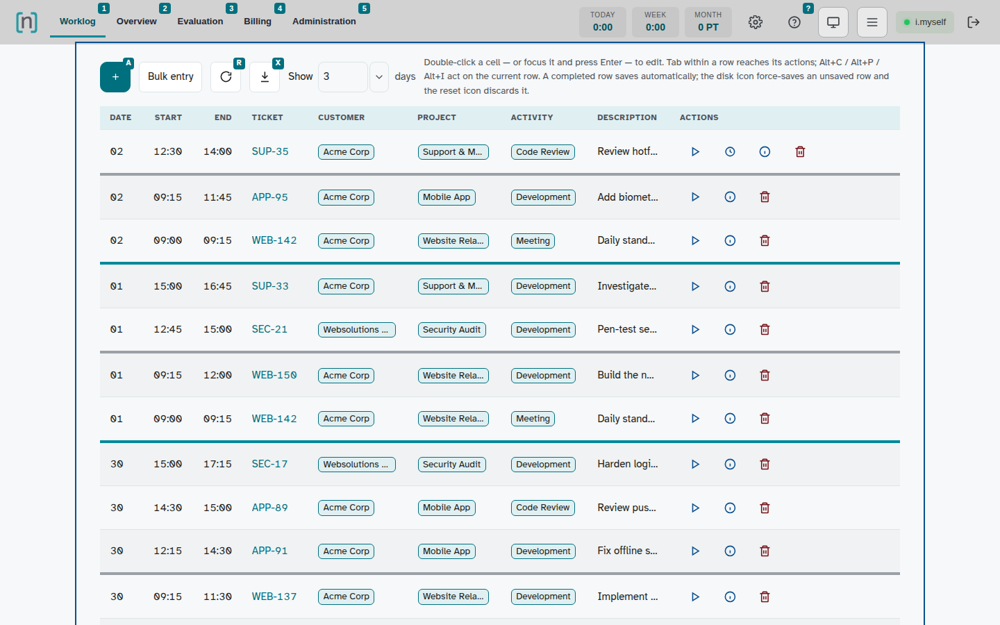

The tables below mirror
[`frontend/src/lib/shortcuts.ts`](../frontend/src/lib/shortcuts.ts).

**Global**

| Keys | Action |
|---|---|
| <kbd>Ctrl</kbd>/<kbd>⌘</kbd>+<kbd>K</kbd> | Open the command palette |
| <kbd>Alt</kbd>+<kbd>1</kbd>…<kbd>7</kbd> | Switch to tab 1–7 |
| <kbd>Alt</kbd>+<kbd>A</kbd> | Add a new entry |
| <kbd>↑</kbd> <kbd>↓</kbd> <kbd>←</kbd> <kbd>→</kbd> | Move between the menu, sub-menu, search and table |
| <kbd>/</kbd> | Jump to the search / filter field |
| <kbd>?</kbd> | Open the shortcut help |

**Data tables**

| Keys | Action |
|---|---|
| <kbd>↑</kbd> <kbd>↓</kbd> <kbd>←</kbd> <kbd>→</kbd> | Move between cells |
| <kbd>Home</kbd> / <kbd>End</kbd> | First / last cell in the row |
| <kbd>Ctrl</kbd>+<kbd>Home</kbd> / <kbd>End</kbd> | First / last cell in the table |
| <kbd>Page ↑</kbd> / <kbd>Page ↓</kbd> | Move up / down a page of rows |
| <kbd>Enter</kbd> / <kbd>F2</kbd> | Edit the cell in place, or use its control |
| <kbd>A</kbd>–<kbd>Z</kbd> <kbd>0</kbd>–<kbd>9</kbd> | Start editing the focused cell by typing |
| <kbd>Enter</kbd> / <kbd>Tab</kbd> / <kbd>Esc</kbd> | While editing: save and move, or cancel |
| <kbd>Ctrl</kbd>+<kbd>C</kbd> / <kbd>Ctrl</kbd>+<kbd>V</kbd> | Copy / paste the focused cell's value |

**Worklog**

| Keys | Action |
|---|---|
| <kbd>Alt</kbd>+<kbd>A</kbd> | Add a new entry |
| <kbd>Alt</kbd>+<kbd>C</kbd> | Continue the selected/last entry |
| <kbd>Alt</kbd>+<kbd>I</kbd> | Show info for the selected/last entry |
| <kbd>Alt</kbd>+<kbd>P</kbd> | Prolong the last entry to the current time |
| <kbd>Alt</kbd>+<kbd>R</kbd> | Refresh the view |
| <kbd>Alt</kbd>+<kbd>X</kbd> | Export entries (CSV) |

## Command palette

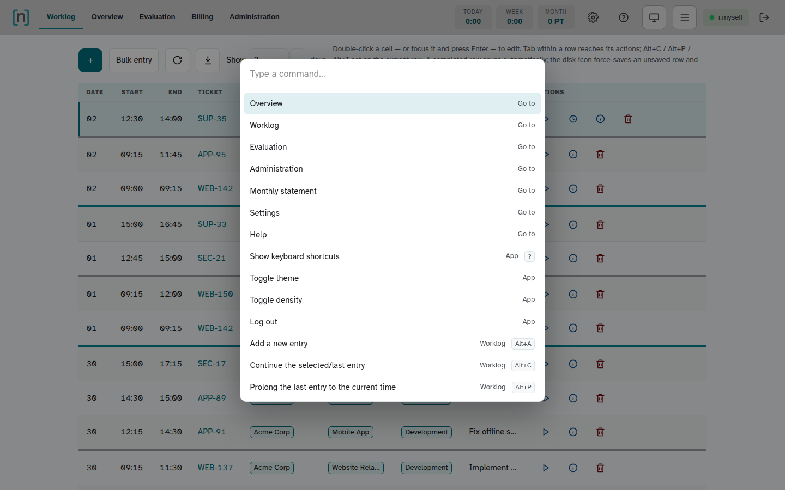

<kbd>Ctrl</kbd>/<kbd>⌘</kbd>+<kbd>K</kbd> opens a searchable palette with
every available action — navigation (respecting your role), app actions
(toggle theme/density, show shortcuts, log out) and page actions: on the
Worklog that includes add/continue/prolong/info/refresh/export, bulk entry
and day-range presets. Navigate with the arrow keys, run with
<kbd>Enter</kbd>. If you forget a shortcut, the palette is the fastest way
to rediscover it.

## Jira integration

When an administrator connects a ticket system of type **Jira** with *time
booking* enabled (Administration → Ticket systems) and assigns it to your
projects:

- **Worklog sync is automatic.** Saving, editing or deleting an entry with a
  ticket mirrors the change as a Jira worklog on that ticket — there is no
  per-entry sync checkbox. If you change an entry's ticket, the worklog on the
  old ticket is cleaned up. Sync runs in the background: your entry always
  saves in TimeTracker even if Jira is unreachable.
- **Authorization is per user and per ticket system.** TimeTracker acts on
  your behalf via OAuth: the first time it needs access it directs you to the
  Jira *authorize* page ("Please authorize: …" with a link). After you approve
  there, Jira sends you back to TimeTracker, the token is stored (encrypted),
  and your most recent entries are synced.
- **Ticket links:** ticket numbers in the Worklog link straight into the
  ticket system.
- Administrators can additionally re-push pending worklogs and sync a
  project's **subtickets** from Jira, and map external tickets to an internal
  Jira project (per-project settings).

There is also an optional **userscript** for showing TimeTracker times inside
Jira — see [features.md](features.md#jira-integration).

## Help

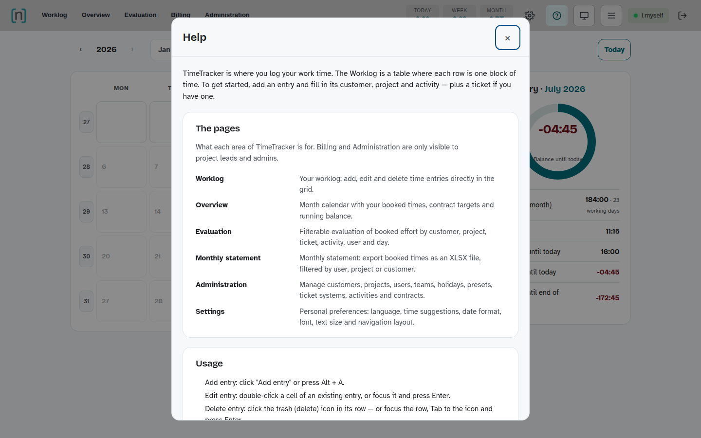

The **?** icon in the header opens the in-app Help page: a short description
of every page, usage basics, the Worklog color/icon legend, all
keyboard-shortcut tables, an explanation of the display controls, and links to
this user guide, the
[project page](https://github.com/netresearch/timetracker) and the OpenAPI
specification (`/api.yml`, for developers).

On your first visit a one-time hint points you at the <kbd>?</kbd> shortcut.

Found a bug or missing a feature? Open an issue at
[github.com/netresearch/timetracker/issues](https://github.com/netresearch/timetracker/issues).
